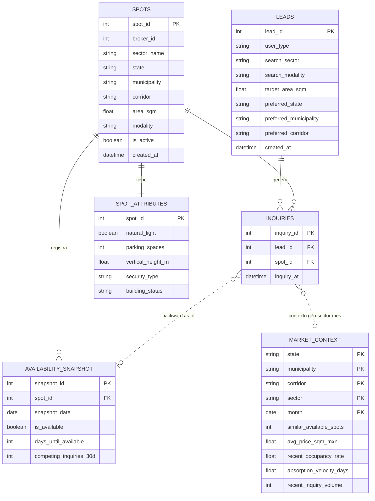

# Spot2 — Lead Opportunity Score

Repositorio de trabajo para la evaluación técnica de Data Science de Spot2. El objetivo es construir y justificar un **Lead Opportunity Score** que combine calidad del lead, capacidad real del inventario para atenderlo y una estrategia de fallback cuando el inmueble ideal no está disponible.

## Navegación rápida

- [Assessment original](assessment.md)
- [README del candidato](README-candidate.md)
- [Diccionario de variables](feature_dictionary.md)
- [Sandbox de experimentos](experimentos/)
- [Descubrimientos acumulados](experimentos/conocimiento_agregado/DESCUBRIMIENTOS.md)
- [Evidencias](experimentos/Evidencias/)

## Modelo entidad–relación

El siguiente diagrama resume las seis tablas entregadas y las relaciones que deben respetarse al construir ABTs, features y evaluaciones.

### Reglas de unión importantes

| Relación | Cardinalidad / regla | Uso correcto |
|---|---|---|
| `leads → inquiries` | 1:N por `lead_id` | Historial de interacción de cada lead. |
| `spots → inquiries` | 1:N por `spot_id` | Inmueble consultado en cada interacción. |
| `spots → spot_attributes` | 1:1 por `spot_id` | Enriquecimiento estático del inmueble. |
| `spots → availability_snapshot` | 1:N temporal | Historial de disponibilidad del inmueble. |
| `inquiries → availability_snapshot` | N:0..1 analítica | Usar el último `snapshot_date <= inquiry_at`; **no** hacer un join directo solamente por `spot_id`. |
| `inquiries → market_context` | N:0..1 contextual | Resolver mediante geografía y sector del spot + mes de `inquiry_at`: `(state, municipality, corridor, sector, month)`. |

> **Nota temporal:** la auditoría relacional mostró que un join directo entre `inquiries` y `availability_snapshot` por `spot_id` expande las filas aproximadamente **10.02×**. La construcción correcta usa un backward as-of join (`latest snapshot_date <= inquiry_at`), evitando información futura. Ver [D025](experimentos/conocimiento_agregado/DESCUBRIMIENTOS.md#d025--la-estructura-relacional-está-limpia-availability-exige-un-join-as-of) y [EV-010](experimentos/Evidencias/EV-010_matching_ab_v3.md).

> **Nota semántica:** `spots.total_inquiries` no debe asumirse equivalente al conteo histórico de la tabla `inquiries`; ambos fueron reconciliados y no representan la misma definición de evento.

## Convención de trabajo

Todo análisis experimental vive por defecto dentro de `experimentos/`. La trazabilidad mínima esperada es:

`experimento → EVIDENCIA.md → Evidencias/EV-... → resultado fuente`

y cada descubrimiento consolidado debe poder recorrerse desde:

`conocimiento_agregado/DESCUBRIMIENTOS.md → EV-... → experimento/resultados`

Esto permite conservar resultados positivos, negativos e inconclusos sin contaminar las entradas canónicas del reto.
