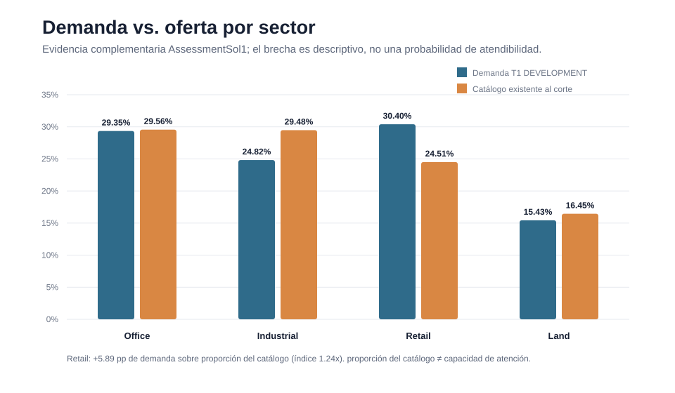
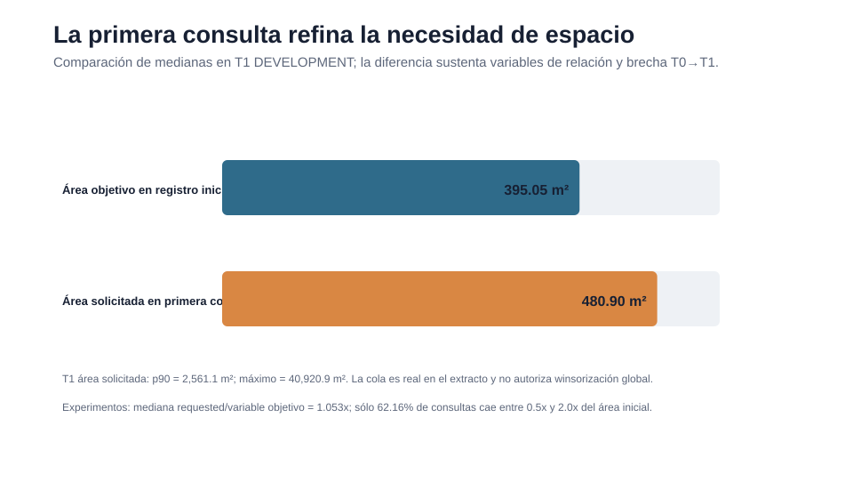
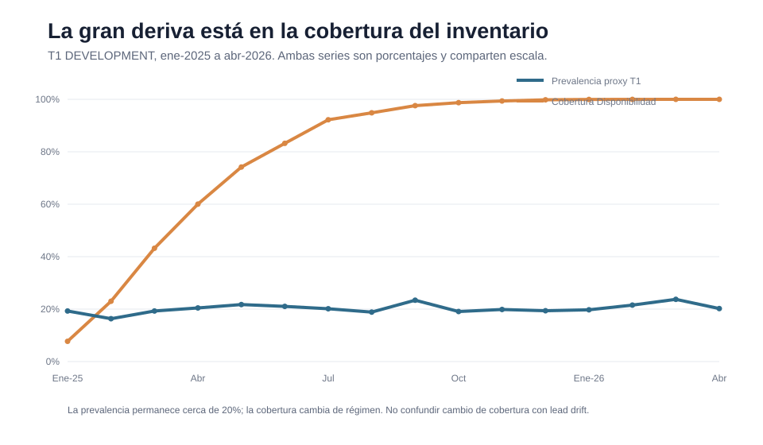
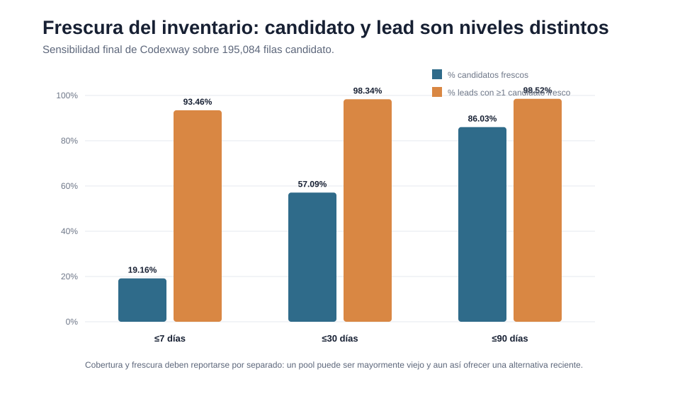
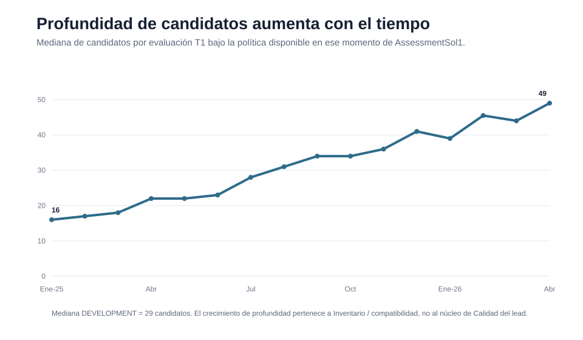
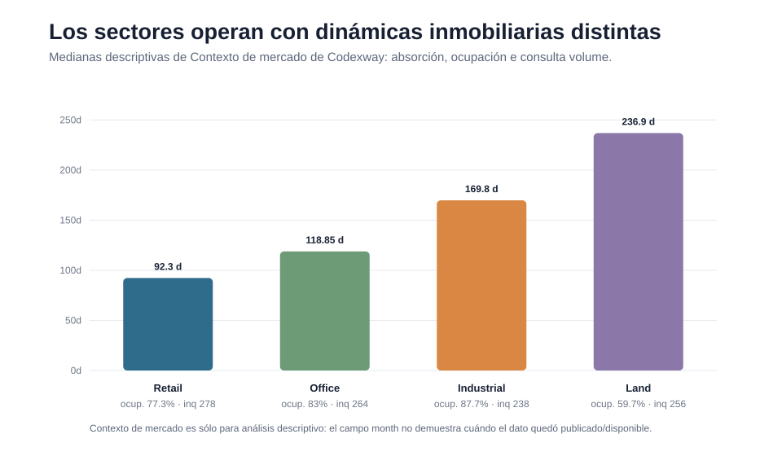

# Entregable 1 — Análisis Exploratorio de Datos (EDA)

## Resumen ejecutivo

Spot2 es un marketplace de dos lados: existe una **demanda** con distinta propensión a avanzar comercialmente y, de forma independiente, existe un **inventario** cuya capacidad de atender esa demanda cambia con el tiempo. El EDA final demuestra que tratar ambas dimensiones como una sola variable sería un error de negocio y de metodología.

La conclusión principal es:

> **La calidad del lead es relativamente estable en composición; la observabilidad y profundidad del inventario no lo son.**

Codexway —autoridad final de esta entrega— congela **T1, la primera inquiry**, como el momento principal de scoring: la solicitud ya fue persistida y todavía no se conoce la respuesta del broker. El proxy principal es **scheduled_visit en esa primera inquiry**, con 4,898 observaciones maduras y una prevalencia de **20.44%**. No es cierre, revenue ni el outcome oculto del assessment; es un proxy observable de avance en el funnel.

A partir de esta base, la revisión cruzada de Codexway, experimentos y AssessmentSol1 deja ocho aprendizajes estructurales:

1. **Retail concentra más demanda que peso relativo en el catálogo histórico**: en el clean-room DEVELOPMENT, 30.40% de demanda frente a 24.51% de catálogo, una brecha de +5.89 pp. Es presión relativa, no serviceability.
2. **La primera inquiry agrega información material**: la mediana de área cambia de 395.05 m² en intake a 480.9 m² en T1; la distribución solicitada tiene una cola muy larga.
3. **El missingness tiene semántica**: urgency no declarado, presupuesto no aplicable y presupuesto desconocido no significan lo mismo.
4. **Availability es temporal y su cobertura cambia de régimen**: la cobertura backward-as-of pasa de niveles mínimos al inicio de 2025 a prácticamente 100% en 2026.
5. **UNKNOWN no es UNAVAILABLE**: ausencia o antigüedad de snapshot significa incertidumbre, no evidencia de que el inmueble no pueda atenderse.
6. **Candidate depth crece mucho con el tiempo**, aun cuando la prevalencia del proxy T1 permanece alrededor de 20%. Esto apoya separar Lead Quality de Inventory.
7. **Precio, geografía y otros campos del listing no están versionados históricamente**. Availability sí puede ser point-in-time; la compatibilidad histórica completa del listing queda condicionada.
8. **Clustering y pockets locales produjeron conocimiento, no una regla final**. Hubo pockets históricos prometedores, pero en el rerun gobernado de Codexway ninguna de 19 celdas elegibles superó BH-FDR 10%; no se usan multiplicadores de clusters.

---

# 1. Pregunta de negocio y unidad de decisión

El assessment no pide simplemente estimar una probabilidad. Growth necesita decidir **qué leads trabajar primero**, sabiendo que un lead atractivo puede ser imposible de atender con el inventario observable en ese momento.

Esto obliga a separar dos preguntas:

- **Lead Quality:** ¿qué tan prometedor es el lead con la información disponible al score?
- **Inventory Serviceability:** ¿qué tan atendible es su necesidad con inventario que podamos afirmar que existía y cuyo estado de disponibilidad podamos reconstruir?

La arquitectura posterior del Lead Opportunity Score nace ya en el EDA: no porque el análisis “quiera” dos modelos, sino porque los datos muestran que **la dinámica del lead y la dinámica del inventario son diferentes**.

## 1.1 Momento principal: T1

Codexway congela como contrato principal:

**lead × primera inquiry × score_time**

El score ocurre:

1. después de persistir el payload de la primera inquiry;
2. antes de cualquier respuesta del broker;
3. sin usar inquiries posteriores;
4. sin usar snapshots futuros;
5. sin usar estado mutable actual como si fuera histórico.

Target final de Codexway:

**scheduled_visit en la primera inquiry**

Con madurez de siete días:

- 4,898 T1 maduros;
- 1,001 positivos;
- prevalencia: **20.44%**;
- 102 leads recientes censurados a la derecha.

La sensibilidad a madurez es muy baja:

| Madurez | Elegibles | Excluidos por censura | Prevalencia |
|---:|---:|---:|---:|
| 7 días | 4,898 | 102 | 20.44% |
| 14 días | 4,836 | 164 | 20.43% |
| 30 días | 4,680 | 320 | 20.41% |

**Qué observamos →** el proxy T1 es estable ante cambios razonables de madurez.  
**Por qué importa →** la narrativa no depende de un cutoff elegido para fabricar una tasa.  
**Riesgo →** scheduled_visit sigue siendo un proxy, no el outcome comercial oculto.  
**Decisión →** mantener T1 como contrato principal y expresar la limitación del target.

Fuentes: [C01], [C05], [C13] en [REFERENCIAS.md](REFERENCIAS.md).

---

# 2. El dataset: relacionalmente limpio, temporalmente peligroso

Las seis tablas canónicas son:

| Tabla | Filas | Qué representa |
|---|---:|---|
| leads | 5,000 | Intake, necesidad inicial, usuario, presupuesto, geografía, fuente |
| inquiries | 22,576 | Eventos lead–spot y payload de solicitud |
| spots | 3,000 | Catálogo de listings |
| spot_attributes | 3,000 | Atributos físicos 1:1 por spot |
| availability_snapshot | 30,000 | Estado histórico de disponibilidad |
| market_context | 500 | Agregados geografía × sector × mes |

CSV y Parquet son dos representaciones equivalentes del mismo contenido; **no se concatenan**. Parquet es la fuente canónica de ejecución.

La auditoría independiente encontró:

- 0 duplicados de PK;
- 0 huérfanos Inquiry→Lead;
- 0 huérfanos Inquiry→Spot;
- 0 huérfanos SpotAttributes→Spot;
- 0 huérfanos Availability→Spot;
- 0 inquiries anteriores a lead.created_at;
- 0 inquiries anteriores a spot.created_at;
- 0 snapshots anteriores a spot.created_at;
- 0 duplicados spot_id × snapshot_date.

Esto es importante porque descarta una explicación fácil: **el reto no está en reparar relaciones rotas**. El reto es evitar usar información correcta en el momento incorrecto.

## 2.1 La trampa de Availability

Availability tiene diez snapshots por spot en mediana. Si se une Inquiry→Availability sólo por spot_id:

- 22,576 inquiries se convierten en **226,151 filas**;
- expansión: **10.017x**.

Si se elige el snapshot temporal “más cercano”:

- **7,758 inquiries** usarían un snapshot futuro;
- equivale a **34.36%** del total.

La única política defendible es:

**último snapshot con snapshot_date <= score_time**

Codexway implementa y testea esta política con backward as-of; su auditoría final registra **0 future-snapshot violations**.

**Qué observamos →** Availability es una relación 1:N temporal.  
**Por qué importa →** un join aparentemente inocente puede cambiar el grano y revelar el futuro.  
**Riesgo →** leakage masivo y métricas artificialmente optimistas.  
**Decisión →** backward as-of obligatorio; nearest y direct join se consideran condiciones leaky.

Fuente: [A01], [C03], [C10].

---

# 3. Quién llega a Spot2: demanda amplia, no una sola “persona”

## 3.1 Sector

Sobre los 5,000 leads de Codexway:

| Sector | Leads | Share |
|---|---:|---:|
| Retail | 1,528 | **30.56%** |
| Office | 1,450 | **29.00%** |
| Industrial | 1,249 | **24.98%** |
| Land | 773 | **15.46%** |

Retail y Office concentran cerca de 60% de la demanda, pero ningún sector domina de forma absoluta.

## 3.2 Modalidad

| Modalidad | Leads | Share |
|---|---:|---:|
| rent | 2,503 | **50.06%** |
| sale | 1,490 | **29.80%** |
| both | 1,007 | **20.14%** |

Las mayores celdas sector × modalidad son:

- Retail + rent: **15.16%**;
- Office + rent: **14.76%**;
- Industrial + rent: **12.22%**;
- Retail + sale: **9.38%**;
- Office + sale: **8.60%**.

## 3.3 Tipo de usuario

| User type | Share |
|---|---:|
| tenant_direct | **39.12%** |
| broker | **36.08%** |
| investor | **19.94%** |
| developer | **4.86%** |

El flujo combina usuarios con incentivos distintos. Por eso no es defendible reducir “calidad” a una regla como broker vs tenant.

## 3.4 Fuente de adquisición

La demanda también está diversificada por adquisición:

- organic: 29.26%;
- paid: 24.92%;
- referral: 20.34%;
- social: 10.48%;
- email: 9.92%;
- event: 5.08%.

**Decisión:** sector, modalidad, user type, source y geografía son contexto de intake legítimo; sus asociaciones son descriptivas, no causales.

Fuente final: [C06], [C07].

---

# 4. Demanda vs. oferta: Retail es la presión relativa más clara

AssessmentSol1 reconstruyó, sólo dentro de DEVELOPMENT y restringiendo Spots a los que ya existían al corte, la composición relativa de demanda y catálogo.

| Sector | Share demanda | Share catálogo | Gap |
|---|---:|---:|---:|
| Office | 29.35% | 29.56% | -0.21 pp |
| Industrial | 24.82% | 29.48% | -4.67 pp |
| Retail | **30.40%** | **24.51%** | **+5.89 pp** |
| Land | 15.43% | 16.45% | -1.02 pp |

Retail tiene un índice demanda/oferta de **1.24x**. Office está prácticamente equilibrado.

### Qué significa

Retail aparece más representado en la necesidad que en el catálogo históricamente existente.

### Qué NO significa

No significa que el 24.51% de spots Retail sea atendible. El share no considera simultáneamente:

- snapshot as-of;
- frescura;
- modalidad;
- área;
- precio;
- corredor/municipio;
- incertidumbre histórica del listing.

**Riesgo →** vender una “brecha de inventario” cuando en realidad sólo se midió share de catálogo.  
**Decisión →** usar el gap como diagnóstico de presión y llevar la atendibilidad al componente Inventory.

Fuente complementaria: [A02], [A06]. La composición general de demanda coincide con [C06].

---

# 5. El proxy comercial cambia por segmento, pero no existe un segmento mágico

Sobre los 4,898 T1 maduros de Codexway:

| Dimensión | Segmento | N | Tasa scheduled_visit |
|---|---|---:|---:|
| Sector | Industrial | 1,220 | **24.34%** |
| Sector | Land | 764 | **21.07%** |
| Sector | Retail | 1,497 | **19.04%** |
| Sector | Office | 1,417 | **18.21%** |
| Canal | app | 1,253 | **21.55%** |
| Canal | web | 1,424 | **21.28%** |
| Canal | phone | 260 | **17.69%** |

Industrial supera descriptivamente a Office en algo más de seis puntos porcentuales. En cambio, user type y source muestran separaciones mucho más modestas.

AssessmentSol1, con otra definición clean-room del target y sólo DEVELOPMENT, reproduce el mismo orden sectorial **Industrial > Land > Retail > Office**. Las tasas exactas no se mezclan con Codexway; la coincidencia sólo sirve como robustez cualitativa.

### asked_visit

En DEVELOPMENT del clean-room:

- asked_visit=true: **21.33%**;
- asked_visit=false: **20.07%**;
- diferencia: **+1.26 pp**.

Su nombre podría hacer pensar que es casi el target. Los datos no sostienen esa lectura.

**Qué observamos →** asked_visit está asociado a avance, pero modestamente.  
**Por qué importa →** es intención explícita conocida al persistir la inquiry.  
**Riesgo →** confundir una feature de intención contemporánea con outcome o atribuirle causalidad.  
**Decisión →** permitirla bajo el contrato T1 y mantener sensibilidad WITH/WITHOUT.

Fuentes: [C07], [A02], [A08].

---

# 6. T0 → T1 → T2: la información disponible cambia de naturaleza

Los tres momentos no son versiones intercambiables del mismo score.

## T0 — creación del lead

Conocemos únicamente intake. Todavía no existe la primera inquiry.

Codexway conserva T0 como sensibilidad a 30 días. Su Lift@10 es aproximadamente **1.02x**, coherente con una señal de ranking débil. La investigación clean-room además detectó que el target T0 se mueve fuertemente con la oportunidad futura de generar inquiries.

**Lectura:** T0 está expuesto a un problema de exposure. Más tiempo/oportunidad para interactuar cambia el outcome medido.

**Decisión final:** no desplazar T1 como contrato principal ni importar al T0 información de inquiries futuras.

## T1 — primera inquiry

Aparece información contemporánea útil:

- canal;
- message_length;
- requested_area;
- presupuesto solicitado aplicable;
- urgency_days;
- asked_visit.

Aquí ocurre el mayor salto semántico: pasamos de una intención declarada en intake a una **necesidad expresada en una interacción concreta**.

## T2 — inquiries posteriores

Sólo puede usar:

- intake;
- payload actual;
- trayectoria de requests estrictamente anteriores al score actual.

Codexway bloquea response history sin timestamp confiable. Su sensibilidad T2 muestra señal top-decile modesta, pero T2 sigue siendo challenger/extensión, no contrato principal.

**Principio:** T0, T1 y T2 condicionan sobre poblaciones y conjuntos de información diferentes; no se promedian ni se interpretan como la misma probabilidad.

Fuentes finales: [C01], [C02], [C12]. Evidencia metodológica alternativa: [A11], [A12].

---

# 7. La primera inquiry refina materialmente la necesidad

En T1 DEVELOPMENT:

- target_area_sqm de intake, mediana: **395.05 m²**;
- requested_area_sqm de la primera inquiry, mediana: **480.9 m²**;
- p90 requested_area: **2,561.1 m²**;
- máximo: **40,920.9 m²**.

La investigación experimental añade dos observaciones:

- mediana requested_area / target_area ≈ **1.053x**;
- sólo **62.16%** de las inquiries cae entre 0.5x y 2.0x del target inicial.

En presupuesto:

- ~81.53% de requested rent budgets cae dentro del intervalo inicial;
- ~81.04% de requested sale budgets cae dentro del intervalo inicial.

La historia no es “el lead cambió completamente de opinión”. Es más interesante: **la inquiry conserva gran parte de la intención inicial, pero la concreta y en una fracción material la reajusta**.

### Implicación para Feature Engineering

Tiene sentido construir, de manera determinística y PIT-safe:

- requested / target area ratio;
- gap absoluto y log-gap;
- dirección LOWER/SAME/HIGHER;
- budget dentro/fuera de intervalo;
- ratio vs midpoint;
- distancia normalizada fuera de rango;
- cambio de completitud T0→T1.

No hace falta un LLM para extraer estas relaciones: ya están estructuradas.

**Riesgo →** winsorizar globalmente la cola o tratar T1 como copia de T0.  
**Decisión →** conservar magnitudes y transformaciones robustas; interpretar por sector y modalidad.

Fuentes: [A02], [A07], [E03], [E04].

---

# 8. Missingness: ausencia de información ≠ ausencia real

Éste es uno de los hallazgos más importantes del EDA.

## 8.1 Presupuesto: missingness estructural por modalidad

En el raw audit:

- lead sale budgets: ~50–52% null global;
- lead rent budgets: ~30–32% null global;
- inquiry sale budget: **49.90%** null;
- inquiry rent budget: **29.55%** null;
- spot sale prices: **39.73%** null;
- spot rent/maintenance: **25.37%** null.

La mayor parte de estas tasas no representa mala captura: un lead de venta no necesita presupuesto de renta y viceversa.

La auditoría experimental distingue además missing real de aproximadamente 3–4% en algunos mínimos cuando el campo sí aplica.

**Decisión:** representar explícitamente estados de presupuesto:

- NOT_APPLICABLE;
- UNKNOWN;
- PARTIAL;
- OBSERVED.

Nunca imputar una mediana global cruzando renta y venta ni mezclar MXN/mes con MXN total.

## 8.2 urgency_days

En T1 DEVELOPMENT:

- missing: **31.34%**;
- mediana observada: **75 días**;
- p90: **296 días**.

Missing significa **“no declarado”**, no “cero días” ni “urgencia mediana”.

**Decisión:** retain missing + flag urgency_not_stated; cualquier señal predictiva del missingness se estima dentro del desarrollo temporal.

## 8.3 Atributos físicos

Sobre spot_attributes:

- charging_ports missing: **20.20%**;
- vertical_height_m: **15.23%**;
- floor_material: **7.87%**;
- varios otros campos: 0%.

Un 0 en charging_ports es distinto de “no sabemos cuántos hay”.

**Decisión:** tratamiento por campo y gating sectorial; no blanket imputation.

Fuentes: [A01], [A02], [A09], [E03].

---

# 9. total_inquiries: dos trampas con el mismo nombre conceptual

Hay dos ideas distintas que deben bloquearse por razones diferentes.

## 9.1 Total futuro de inquiries por lead

Si miramos todo el historial entregado después de T1:

- media DEVELOPMENT: **4.58**;
- mediana: **5**;
- máximo: **8**.

Es útil para entender exposición, pero en T1 todavía no sabemos cuántas interacciones tendrá el lead.

Además, la media cae de aproximadamente **4.97** en 2025H1 a **3.92** en abril de 2026 conforme nos acercamos al borde de extracción. Es un reloj de maduración.

**Decisión:** EDA_ONLY / FORBIDDEN como T1 feature.

## 9.2 spots.total_inquiries

El raw audit demuestra que el contador actual de Spots coincide con el conteo reconstruible de la tabla inquiries en sólo:

**212 / 3,000 spots = 7.07%**

No puede asumirse que tenga la misma semántica que un event count histórico.

**Decisión:** bloquear el raw current-state total_inquiries. Si se necesita historia de demanda de un spot, reconstruirla sólo con eventos que existían antes de score_time.

Fuente: [A01], [A03], [E03].

---

# 10. Availability: cobertura, frescura y disponibilidad son tres conceptos distintos

## 10.1 Cobertura histórica

En las 22,576 inquiries:

- backward coverage: **92.38%**;
- lag mediano: **6.61 días**;
- p90: **58.66 días**;
- p95: **83.35 días**;
- 4.20% de las cubiertas tiene lag >90 días.

La media agregada es engañosa porque la cobertura cambia radicalmente con el tiempo:

- ene-2025: **6.46%** en auditoría all-inquiries;
- jun-2025: **84.69%**;
- sep-2025: **96.57%**;
- desde ene-2026: **100%**.

En el universo DEVELOPMENT de candidatos, la misma historia aparece incluso con otra granularidad:

- ene-2025: **7.72%**;
- mar/abr-2026: **100%**.

El target T1 permanece alrededor de 20% mientras Availability cambia de régimen. Eso es evidencia fuerte de que **coverage drift no debe confundirse con lead drift**.

## 10.2 UNKNOWN != UNAVAILABLE

Si no hay snapshot anterior al score:

- no sabemos el estado;
- no podemos afirmar que el inmueble estaba no disponible.

Codexway formaliza esta incertidumbre con bounds de serviceability. En su auditoría final:

- exact attendable share: **45.64%**;
- exact unknown share: **44.30%**;
- no known alternative: **2.38%**;
- no potential alternative: **0%**.

El 44.30% unknown ilustra por qué un modelo binario “available/no” sería excesivamente confiado.

## 10.3 Frescura

Incluso cuando sí existe snapshot, su edad importa.

Codexway:

| Freshness | Candidatos frescos | Leads con ≥1 candidato fresco |
|---|---:|---:|
| <=7d | **19.16%** | **93.46%** |
| <=30d | **57.09%** | **98.34%** |
| <=90d | **86.03%** | **98.52%** |

Esto revela una distinción útil: el pool completo de un lead puede contener mucho estado viejo y, al mismo tiempo, tener al menos una opción con evidencia reciente.

**Decisión:** reportar cobertura, freshness y serviceability por separado; snapshot age funciona como confianza/monitoring, no como señal de Lead Quality.

Fuentes: [C09], [C10], [A01], [A02], [A08].

---

# 11. Candidate depth: el inventario “visible” crece más que la calidad del lead

En T1 DEVELOPMENT:

- mediana global: **29 candidatos**;
- media: **34.63**;
- p90: **63**;
- máximo: **143**.

Por mes, la mediana pasa de:

- **16** en enero de 2025;
- a **49** en abril de 2026.

El target prevalence no exhibe una trayectoria comparable. Al mismo tiempo, el mix marginal de sector, modalidad, user_type, source y channel tiene Jensen–Shannon <0.0026 contra 2025H1 en la auditoría clean-room.

**Qué observamos →** la profundidad de candidatos cambia fuertemente, el mix básico de leads mucho menos.  
**Por qué importa →** una parte grande de la no-estacionariedad pertenece al sistema de oferta/exposición.  
**Riesgo →** permitir candidate depth o coverage en Lead Quality puede hacer que el modelo aprenda la era del dataset.  
**Decisión →** candidate depth pertenece a Inventory/Matching y a monitoreo.

Fuentes: [A02], [A03], [A07], [A08].

---

# 12. Precios, listing state y la frontera de lo que sí es PIT

Codexway hace una distinción importante:

### Availability

Sí existe una tabla versionada en el tiempo. Por tanto puede afirmarse:

**snapshot_date <= score_time**

y la unión puede ser estrictamente point-in-time.

### Price, area, geography y otros listing fields

spot.created_at prueba que el listing existía. **No prueba que cada campo entregado tenga el mismo valor histórico**.

No hay:

- price_effective_at;
- geography_effective_at;
- attribute_update_at;
- version_id del listing.

Por eso Codexway congela:

> Availability es PIT-correct; el score histórico completo de compatibilidad/fallback permanece condicionado por campos de listing no versionados.

AssessmentSol1 exploró una asunción explícita de inmutabilidad de spot_attributes para su clean-room. Esa asunción es útil para medir qué pasaría bajo un contrato explícito, pero **no reemplaza la decisión más estricta de Codexway**.

### Precios

El clean-room describe:

- rent total mediano del extracto: ~MXN **109.7k**;
- sale total mediano: ~MXN **19.3M**;
- colas extremas grandes.

Sirven para narrativa y QA, no para afirmar que ése era el precio vigente en cada score histórico.

**Decisión:** pedir versionado de listing fields en producción; mientras tanto, distinguir “existencia del spot” de “estado histórico del spot”.

Fuentes: [C02], [C03], [C10], [A01], [A02].

---

# 13. Market Context: útil para entender el mercado, no para mirar el pasado

Market Context contiene información interpretable:

| Sector | Precio/m² mediano | Ocupación mediana | Absorción mediana | Inquiry volume mediano |
|---|---:|---:|---:|---:|
| Industrial | 140.56 | **87.7%** | 169.8 d | 238 |
| Land | 45.00 | 59.7% | **236.9 d** | 256 |
| Office | **357.96** | 83.0% | 118.85 d | 264 |
| Retail | 288.49 | 77.3% | **92.3 d** | **278** |

La heterogeneidad es material:

- Retail rota más rápido y muestra el mayor inquiry volume mediano.
- Office tiene el mayor precio/m² mediano.
- Industrial combina ocupación alta con absorción bastante más lenta.
- Land es una economía distinta: menor precio/m², menor ocupación y absorción más lenta.

A nivel corredor, la evidencia complementaria encuentra ejemplos como:

- Retail centro-chihuahua: absorción media ~**74 días**;
- Retail lomas-verdes-satelite: ~**82 días**;
- Retail del-valle-narvarte: ~**84 días**;
- varios corredores Industrial: ocupación ~0.88–0.90, pero absorciones ~150–185 días.

### Límite PIT

El campo temporal es month. No existe publication_time ni effective_time.

Además, el matching exacto geografía × sector × mes cubre sólo:

**5,383 / 22,576 = 23.84%** de las inquiries.

Incluso con 100% de coverage, seguiría faltando el reloj de publicación.

**Decisión final:** **EDA_ONLY**. No usar same-month Market Context como historical feature.

Fuentes: [C08], [A01], [A10].

---

# 14. No estacionariedad no es lo mismo que estacionalidad

Codexway observa que el volumen de leads nuevos se mantiene relativamente acotado mientras las inquiries crecen de forma mucho más pronunciada durante el periodo observado.

AssessmentSol1 muestra en DEVELOPMENT:

- T1 mensuales: aproximadamente 166–325;
- Availability coverage: 7.72% → 100%;
- candidate depth: 16 → 49;
- lead-to-first-inquiry lag medio: ~10.75d en 2025H1 → ~30.43d en abr-2026;
- future inquiry exposure: ~4.97 → ~3.92.

Con apenas ~16–18 meses útiles y varios clocks moviéndose a la vez, sería metodológicamente débil afirmar una “temporada alta” recurrente.

El propio assessment advierte que los datos son sintéticos. Hay patrones demasiado limpios —máximo fijo de interacciones, cobertura creciente, mix categórico muy estable— que pueden responder al generador o al proceso.

**Qué observamos →** existe no-estacionariedad.  
**Por qué importa →** afecta validación temporal y monitoreo.  
**Riesgo →** convertir un artefacto de cobertura/proceso en una feature de calendario o una historia de estacionalidad.  
**Decisión →** hablar de drift de población, exposición, cobertura y clocks por separado; no vender una ley estacional.

Fuente: [A03], [A08], [C14].

---

# 15. Segmentación y clustering: conocimiento acumulado, no etiquetas mágicas

La línea experimental probó múltiples representaciones. Su mayor valor fue descubrir **qué conceptos merecen separarse**.

## 15.1 Lo que sí aprendimos

### Search Need

Una representación experimental outcome-free produjo perfiles semánticamente claros:

- renta;
- venta;
- both + mayor área.

La utilidad está en reconocer que “qué busca” es una faceta distinta de “quién es”.

### Physical vs Location

Los primeros Spot clusters mezclaban atributos físicos y geografía. La investigación mostró que deben separarse:

- **Physical:** qué es el espacio;
- **Location:** dónde está.

Codexway confirma esta separación como familias que superan sus gates de representación.

### Broker Service

Una faceta de servicio fue más defendible que intentar clusterizar “supply” del broker. Codexway conserva Broker Service como auxiliar; no lo transforma en causalidad.

### Dynamic Need

El experimento v4 encontró una transición T0→T1 muy asimétrica:

- un perfil de necesidad de renta permanecía en el mismo Dynamic Need en **99.82%**;
- venta y both se redistribuían entre varios estados T1.

Esto apoya la idea de que **la necesidad se refina de forma distinta por modalidad**.

Pero el rerun final de Codexway rechaza dynamic_need_profile por su gate de balance. El concepto sobrevive; el ID de cluster no.

## 15.2 Resultado negativo importante: Inquiry Intent aprendía weekday

Un cluster llamado “Inquiry Intent” terminó correspondiendo casi exactamente a días de la semana.

Éste es un ejemplo de por qué clustering sin outcome puede ser técnicamente estable y semánticamente inútil.

**Decisión:** no promover clusters por silhouette/ARI solamente; exigir interpretación y utilidad de negocio.

Fuentes: [E01], [E02], [C11].

---

# 16. Pockets Lead × Spot × Broker: señal local histórica, no regla final

La exploración encontró celdas locales interesantes. El ejemplo más fuerte del v4 fue:

**DN4 × LOC1 × BSV1**

- N=60;
- scheduled_visit raw: **36.67%**;
- tasa suavizada: **31.37%**;
- lift histórico: **1.510x**;
- Wilson lower rate / baseline: **1.234x**.

Otras celdas históricas también mostraron lift >1.

Sería tentador multiplicar el score cuando aparezca una de estas combinaciones. No se hace.

### Por qué no se promueve

1. Las celdas fueron inspeccionadas en el mismo future test usado para discovery.
2. Hubo múltiples comparaciones.
3. Los labels numéricos de clusters no son identidades semánticas estables entre refits.
4. Dynamic Need no pasó el gate actual de Codexway.
5. En la tabla confirmatoria actual de Codexway:
   - 19 celdas elegibles;
   - **0 pasan BH-FDR 10%**.

**Qué observamos →** hay heterogeneidad local potencial.  
**Por qué importa →** puede inspirar routing o experimentos de producto.  
**Riesgo →** overfit por discovery, multiplicidad y etiquetas inestables.  
**Decisión →** conservar los pockets como hipótesis para nueva cohorte o A/B; nunca como multiplicador final.

Fuentes: [E02], [C11].

---

# 17. Calidad semántica del inventario: un problema real, pero distinto al ranking del lead

La investigación LLM/Rules encontró anomalías cross-field útiles para QA del catálogo.

Evidencia experimental sobre 3,000 spots:

- direct conflict: **322** spots;
- Land × building-copy: **230**;
- security ambiguity: **327**;
- Retail adaptive-use language: **109**;
- cualquier ambigüedad semántica: **429**;
- al menos una señal semántica: **890**.

Importante: estas cifras son **flags de QA**, no errores humanos confirmados.

El patrón Land × building-copy fue especialmente útil: lenguaje como “iluminación natural”, “recién remodelado” o “acabados” puede ser incoherente con un listing de terreno. Esto también justifica gatear atributos built-environment para Land.

La investigación posterior encontró que convertir estas reglas en features **no mejoró el Lift@10 de Lead Quality**. Es un resultado negativo valioso:

> una inconsistencia del catálogo puede ser operacionalmente real y, aun así, no ser señal de propensión del lead.

**Decisión:** mantener semantic QA como sidecar de Inventory/Catalog Quality; no mezclarlo con Lead Quality.

Otro hallazgo de calidad: el copy sintético está altamente templated; la auditoría experimental registra apenas 12 frases únicas componiendo las descripciones actuales. Esto reduce el valor de embeddings/LLM como feature histórica y aumenta el riesgo de aprender templates.

Fuentes: [E03], [E05], [E06], [E04].

---

# 18. Broker response y clocks: por qué no se usa response time como atajo

broker_response y broker_response_hours son posteriores al score y no son features T1.

Además, el raw audit encuentra semántica inconsistente:

- scheduled_visit: 4,496 filas;
- **673 scheduled_visit sin response hours**;
- no_response: 4,483 filas;
- **3,786 no_response con response hours poblado**.

Sin un response_event_at confiable, broker_response_hours no define un reloj histórico seguro.

**Decisión final de Codexway:** no usar response history en el score T1; T2 tampoco la recupera sin timestamp defendible.

Fuente: [A01], [C03].

---

# 19. Qué hallazgos pasan a Feature Engineering

El EDA no selecciona features por correlación. Selecciona transformaciones sólo cuando existe una historia temporal y de negocio defendible.

## Promover / construir

**Intake**
- user_type;
- company_size;
- industry;
- search_sector;
- search_modality;
- target_area;
- presupuestos aplicables;
- geografía preferida;
- source.

**Current inquiry en T1**
- channel;
- message_length;
- requested_area;
- requested budget aplicable;
- urgency_days + urgency_not_stated;
- asked_visit con sensibilidad explícita.

**Refinamiento T0→T1**
- requested_to_target_area_ratio;
- gap de área;
- dirección de refinamiento;
- budget consistency;
- distancia a intervalo;
- completeness delta;
- conteo de cambios de necesidad.

## Mantener fuera del Lead Quality core

- Availability;
- candidate depth;
- snapshot age;
- spot físico;
- selected-spot context;
- market context;
- clustering IDs como reglas;
- raw total_inquiries;
- future inquiry count;
- broker_response;
- broker_response_hours;
- current mutable spot state.

La razón no es que estas variables “no tengan señal”, sino que **responden a otra pregunta o tienen un reloj insuficiente**.

---

# 20. Qué hallazgos pasan a modelado y diseño del producto

## 20.1 Lead Quality e Inventory deben permanecer como ejes separados

El EDA muestra que:

- target prevalence T1 es relativamente estable;
- candidate depth cambia mucho;
- Availability coverage cambia de régimen;
- freshness tiene otra escala;
- Retail muestra presión relativa distinta.

La UI y el sistema deben poder explicar:

- **Quality alto + Inventory alto:** trabajar ahora;
- **Quality alto + Inventory incierto:** priorizar revisión/fallback, no confundir incertidumbre con rechazo;
- **Quality alto + Inventory bajo:** oportunidad comercial que necesita alternativa;
- **Quality bajo + Inventory alto:** oferta disponible no compensa baja prioridad del lead.

## 20.2 Validación temporal es obligatoria

No basta split aleatorio porque:

- coverage cambia;
- depth cambia;
- clocks cambian;
- algunos campos son current-state;
- el holdout histórico ya fue consumido durante investigación.

La confirmación real de nuevas hipótesis requiere nueva cohorte forward.

## 20.3 La siguiente mejora de datos vale más que otro clusterer

La investigación ya probó suficientes variantes de clustering para concluir que el cuello de botella no es K-Means vs GMM.

Los datos que realmente reducirían incertidumbre son:

- versionado de listing fields;
- publication/effective time de Market Context;
- timestamps fiables de response events;
- outcome comercial real;
- exposición a recomendaciones/fallback;
- raw inquiry text si se quiere semántica de intención;
- inventory event history más denso y estable.

---

# 21. Riesgos y limitaciones

1. **Target proxy.** scheduled_visit no es cierre ni revenue.
2. **Datos sintéticos.** Algunos patrones pueden ser artefactos del generador.
3. **Holdout histórico consumido.** Las hipótesis descubiertas después no tienen confirmación independiente.
4. **Availability coverage drift.** Cohortes tempranas tienen menor observabilidad.
5. **Listing fields sin versión.** Price/area/geography no permiten una afirmación PIT completa.
6. **Market Context sin publication time.** EDA_ONLY.
7. **Missingness estructural.** Un null puede significar no-aplica, desconocido o no-declarado.
8. **Outliers plausibles.** Colas de área/precio no deben eliminarse automáticamente.
9. **Clustering multiplicity.** Pockets locales son hipótesis.
10. **Text templated.** La semántica disponible del listing puede reflejar templates más que contenido rico.
11. **Causalidad.** Tasas por canal, source, sector o asked_visit son asociaciones.
12. **Inventory outcome no alineado.** El target de Lead Quality no observa éxito causal de un fallback.

---

# 22. Conclusiones ejecutivas

El EDA cambia la manera de formular el problema.

No estamos frente a “un dataset de leads con unas cuantas features inmobiliarias”. Estamos frente a un sistema temporal de marketplace donde:

- la necesidad existe en T0 y se refina en T1;
- la trayectoria posterior sólo puede usarse si ya ocurrió;
- la oferta crece y cambia de observabilidad;
- no observar Availability no es observar indisponibilidad;
- un listing existente no implica que su precio actual sea históricamente válido;
- el contexto de mercado explica, pero no tiene un reloj suficiente para backtesting;
- clusters ayudan a descubrir facetas, pero la multiplicidad impide convertir pockets en reglas sin nueva evidencia.

La decisión que produjo este conocimiento acumulado es coherente con Codexway:

> **T1 es el contrato principal; Lead Quality e Inventory Serviceability permanecen separados; Availability usa backward as-of; uncertainty es explícita; Market Context y listing state no versionado no entran como si fueran históricos; y los hallazgos de clusters se usan para aprender, no para sobreajustar.**

---

# 23. Tabla final — Hallazgo → Evidencia → Implicación → Decisión

| Hallazgo | Evidencia | Implicación | Decisión |
|---|---|---|---|
| T1 es el momento principal | Codexway: primera inquiry antes de broker response; 4,898 maduros; 20.44% | Es el primer punto donde existe intención accionable sin mirar outcome | Mantener T1 como contrato principal |
| Retail tiene presión relativa | 30.40% demanda vs 24.51% catálogo; +5.89 pp | La demanda Retail puede enfrentar menor cobertura relativa | Tratarlo como diagnóstico de Inventory, no como probabilidad |
| La inquiry refina el área | 395.05 m² → 480.9 m² mediana; p90 T1 2,561.1 | T1 agrega información material | Features determinísticas T0→T1 |
| Presupuesto tiene missing estructural | Nulls globales altos por rent/sale; missing real menor cuando aplica | No-aplica ≠ desconocido | Estados de aplicabilidad; no imputación global |
| urgency missing es semántico | 31.34% no declarado | Zero-fill inventaría una urgencia | Flag not_stated |
| asked_visit es intención, no outcome | +1.26 pp en clean-room | Señal contemporánea modesta | Allow + sensibilidad WITH/WITHOUT |
| total future inquiries es un clock | Mediana 5; cae cerca del borde temporal | Leakage/exposure si entra a T1 | Prohibir; sólo historia estrictamente previa |
| spots.total_inquiries no es event count | Sólo 7.07% coincide con reconstrucción | Campo current-state semánticamente distinto | Bloquear raw |
| Availability requiere backward as-of | Nearest usaría futuro en 34.36% | Riesgo severo de leakage | Backward only |
| UNKNOWN != UNAVAILABLE | 44.30% exact unknown en audit final | La incertidumbre debe sobrevivir al score | Bounds/confidence explícitos |
| Frescura ≠ cobertura | 19.16% candidatos <=7d vs 93.46% leads con alguno | Dos niveles distintos de confianza | Medir por candidato y lead |
| Candidate depth deriva | Mediana 16 → 49 | Inventory/exposure cambia más que lead mix | Fuera de Lead Quality |
| Listing fields no están versionados | No effective time de precio/área/geografía | Matching histórico completo no es estrictamente PIT | Mantener claim CONDITIONAL |
| Market Context no tiene publication time | Exact coverage 23.84%, pero sólo month | Mismo mes no garantiza disponibilidad informacional | EDA_ONLY |
| No hay evidencia sólida de estacionalidad | Horizonte corto + coverage/process drift | Riesgo de narrar artefactos | Hablar de no-estacionariedad |
| Dynamic Need es concepto, no regla final | T0→T1 asimétrico; profile falla gate Codexway | Refinamiento real, cluster ID inestable | FE determinístico; no multiplicador DN |
| Pocket local histórico no se confirma | DN4×LOC1×BSV1 1.510x histórico; 0/19 celdas final FDR | Discovery útil pero multiplicidad | Nueva cohorte/A-B, no regla |
| Physical y Location deben separarse | Investigación + gates de Codexway | “Qué es” y “dónde está” son facetas distintas | Mantener familias separadas |
| Semantic QA no es Lead Quality | Flags reales de catálogo; ablation no mejora ranking | Calidad del dato y propensión son problemas distintos | Sidecar de Inventory QA |

Versión CSV auditable: [tablas/02_hallazgos_decisiones.csv](tablas/02_hallazgos_decisiones.csv).

---

# 24. Tabla final — Fuente → Elemento aprovechado → Rol

| Fuente | Elemento aprovechado | Rol en la solución final |
|---|---|---|
| **codexway** | Contrato T1, target, cifras canónicas, política de features, backward as-of, Inventory bounds, Market Context EDA_ONLY, clustering confirmatorio | **Autoridad final.** Define narrativa y decisiones. Ninguna otra solución lo reemplaza. |
| **experimentos** | Need refinement, Dynamic Need, Physical/Location, Broker Service, pockets locales, QA semántica, resultados negativos | **Evidencia experimental.** Convierte iteraciones en hipótesis y conocimiento; cualquier métrica histórica se etiqueta como challenger/experimento. |
| **AssessmentSol1** | Integridad relacional, demand/supply, missingness, candidate depth, drift, leakage y PIT audit | **Auditoría metodológica.** Cuantifica riesgos y prueba decisiones desde un clean-room alternativo sin sustituir Codexway. |

Versión CSV: [tablas/03_fuentes_integradas.csv](tablas/03_fuentes_integradas.csv).

---

## Apéndice: artefactos de este entregable

### Figuras
- [01 — Demanda vs oferta sector](figuras/01_demanda_vs_oferta_sector.svg)
- [02 — Target vs coverage temporal](figuras/02_target_vs_coverage_temporal.svg)
- [03 — Candidate depth temporal](figuras/03_candidate_depth_temporal.svg)
- [04 — Refinamiento de área](figuras/04_refinamiento_area.svg)
- [05 — Market Context por sector](figuras/05_market_context_sector.svg)
- [06 — Frescura de inventario](figuras/06_frescura_inventario.svg)

### Tablas
- [Resumen de fuentes](tablas/00_resumen_fuentes.csv)
- [Métricas EDA clave](tablas/01_metricas_eda_clave.csv)
- [Hallazgos y decisiones](tablas/02_hallazgos_decisiones.csv)
- [Fuentes integradas](tablas/03_fuentes_integradas.csv)

### Trazabilidad
- [Referencias](REFERENCIAS.md)

<!-- Definiciones de referencias: mantienen el documento legible y cada ID navegable. -->
[C01]: ../../codexway/README.md
[C02]: ../../codexway/evidence/DECISIONS.md
[C03]: ../../codexway/evidence/LEAKAGE_MATRIX.md
[C05]: ../../codexway/outputs/metrics/eda_summary.json
[C06]: ../../codexway/outputs/tables/lead_mix.csv
[C07]: ../../codexway/outputs/tables/target_rate_by_segment.csv
[C08]: ../../codexway/outputs/tables/market_context_eda.csv
[C09]: ../../codexway/outputs/tables/inventory_freshness_sensitivity.csv
[C10]: ../../codexway/outputs/metrics/inventory_audit.json
[C11]: ../../codexway/outputs/CLUSTER_FINDINGS.md
[C12]: ../../codexway/outputs/metrics/t0_t2_sensitivity_metrics.json
[C13]: ../../codexway/outputs/tables/target_maturity_sensitivity.csv
[C14]: ../../codexway/evidence/CHRONOLOGY.md
[A01]: ../../AssessmentSol1/evidence/DATA_AUDIT.md
[A02]: ../../AssessmentSol1/evidence/EDA_FINDINGS.md
[A03]: ../../AssessmentSol1/evidence/DRIFT_FINDINGS.md
[A06]: ../../AssessmentSol1/outputs/eda/demand_inventory_sector_gap.csv
[A07]: ../../AssessmentSol1/outputs/eda/numeric_summary.csv
[A08]: ../../AssessmentSol1/outputs/eda/monthly_t1_development.csv
[A09]: ../../AssessmentSol1/outputs/eda/inventory_summary.csv
[A10]: ../../AssessmentSol1/outputs/eda/market_context_highlights.csv
[A11]: ../../AssessmentSol1/evidence/T0_EXPOSURE_DRIFT.md
[A12]: ../../AssessmentSol1/evidence/T2_TRAJECTORY_DECISION.md
[E01]: ../../experimentos/Evidencias/EV-006_profile_clustering_v2.md
[E02]: ../../experimentos/Evidencias/EV-013_matching_profiles_v4.md
[E03]: ../../experimentos/abt_feature_engineering/variable_treatment_manifest.csv
[E04]: ../../experimentos/conocimiento_agregado/DESCUBRIMIENTOS.md
[E05]: ../../experimentos/Evidencias/EV-017_llm_semantic_feature_pilot.md
[E06]: ../../experimentos/semantic_rules_lift_ablation/results/REPORT.md
