# Spot 2 · Evidencia visual · Fase 1

Esta primera fase agrega **20 visualizaciones** para cubrir transversalmente las líneas de trabajo del repositorio. Las visualizaciones cuantitativas se construyen a partir de resultados ya versionados. Los diagramas marcados como **conceptuales** describen diseño/arquitectura y no deben interpretarse como evidencia causal.

> Criterio: una figura debe ayudar a responder al menos una de estas preguntas: **¿qué se probó?, ¿qué ganó?, ¿qué tan estable es?, ¿qué explica el resultado?, ¿qué riesgo o limitación permanece?**

---

## 1. Cobertura visual previa a esta fase

Antes de esta intervención, de EV-001 a EV-015 sólo dos líneas tenían PNG versionados explícitos: benchmark de especialistas e interpretabilidad T2.

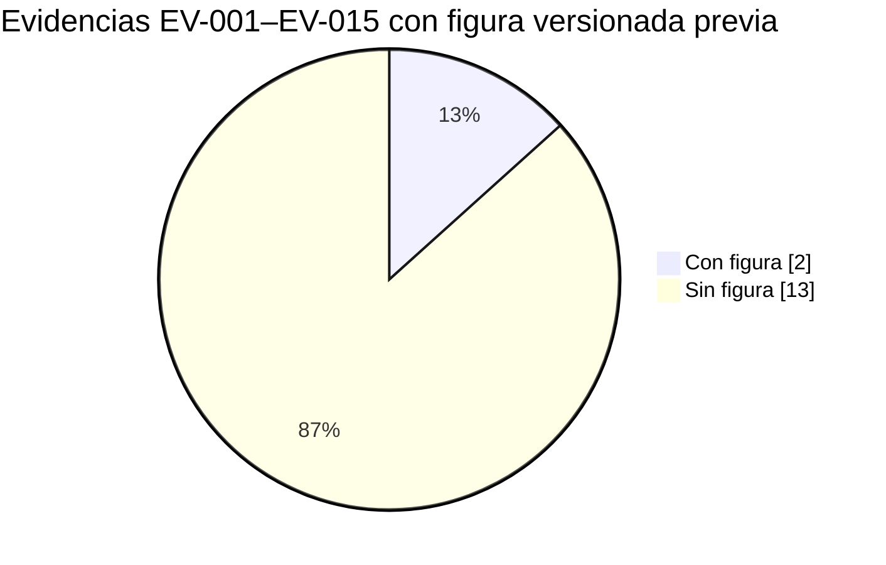
```mermaid
pie showData
    title Evidencias EV-001–EV-015 con figura versionada previa
    "Con figura" : 2
    "Sin figura" : 13
```

**Lectura:** la trazabilidad documental era fuerte, pero la evidencia visual estaba subrepresentada.

---

## 2. Lead attention · cadena causal propuesta

**CONCEPTUAL** — no representa un efecto causal estimado.

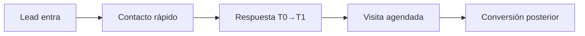
```mermaid
flowchart LR
    A[Lead entra] --> B[Contacto rápido]
    B --> C[Respuesta T0→T1]
    C --> D[Visita agendada]
    D --> E[Conversión posterior]
```

**Fuente:** `experimentos/lead_attention/`.

---

## 3. Response-time Random Forest · diseño experimental

**CONCEPTUAL / PRELIMINAR**

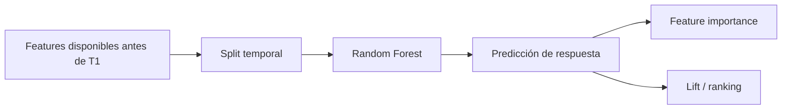
```mermaid
flowchart LR
    A[Features disponibles antes de T1] --> B[Split temporal]
    B --> C[Random Forest]
    C --> D[Predicción de respuesta]
    D --> E[Feature importance]
    D --> F[Lift / ranking]
```

**Fuente:** `experimentos/response_time_random_forest/`.

---

## 4. Geographic enrichment · capas de señal

**CONCEPTUAL**

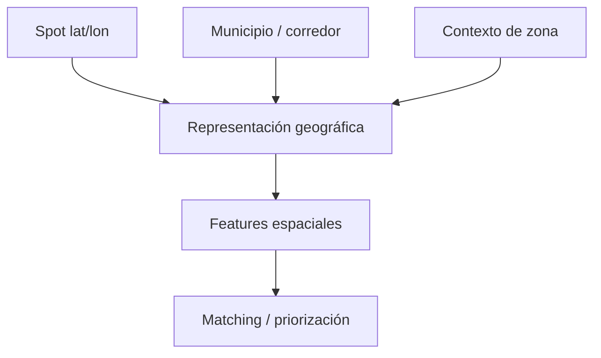
```mermaid
flowchart TB
    A[Spot lat/lon] --> D[Representación geográfica]
    B[Municipio / corredor] --> D
    C[Contexto de zona] --> D
    D --> E[Features espaciales]
    E --> F[Matching / priorización]
```

**Fuente:** `experimentos/geographic_enrichment/`.

---

## 5. LLM triage · lugar correcto del LLM

**CONCEPTUAL**

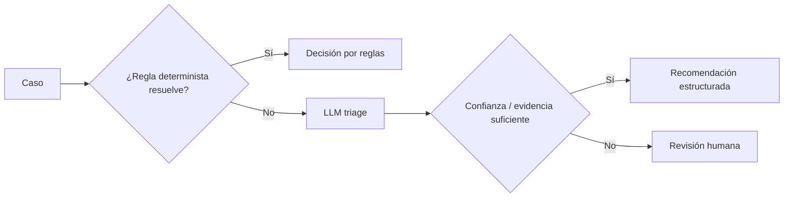
```mermaid
flowchart LR
    A[Caso] --> B{¿Regla determinista resuelve?}
    B -- Sí --> C[Decisión por reglas]
    B -- No --> D[LLM triage]
    D --> E{Confianza / evidencia suficiente}
    E -- Sí --> F[Recomendación estructurada]
    E -- No --> G[Revisión humana]
```

**Fuente:** `experimentos/llm_triage/`.

---

## 6. Entity profile match · lift de mejores celdas

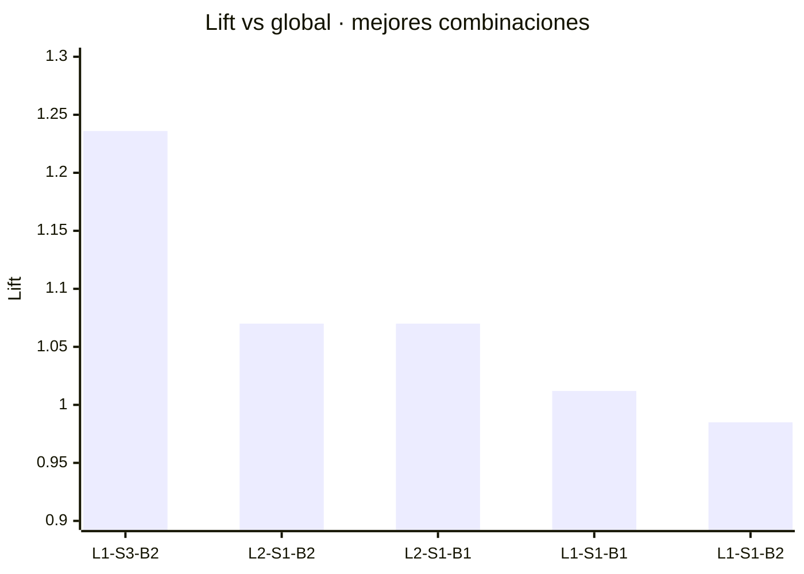
```mermaid
xychart-beta
    title "Lift vs global · mejores combinaciones"
    x-axis ["L1-S3-B2","L2-S1-B2","L2-S1-B1","L1-S1-B1","L1-S1-B2"]
    y-axis "Lift" 0.9 --> 1.3
    bar [1.236,1.070,1.070,1.012,0.985]
```

**Lectura:** L1-S3-B2 es la combinación con mayor lift en este corte, aunque con `n=41`, por lo que la incertidumbre importa.

**Fuente:** `experimentos/entity_profile_match/results/top_combinations.csv`.

---

## 7. Profile clustering v2 · silhouette de clusterers seleccionados

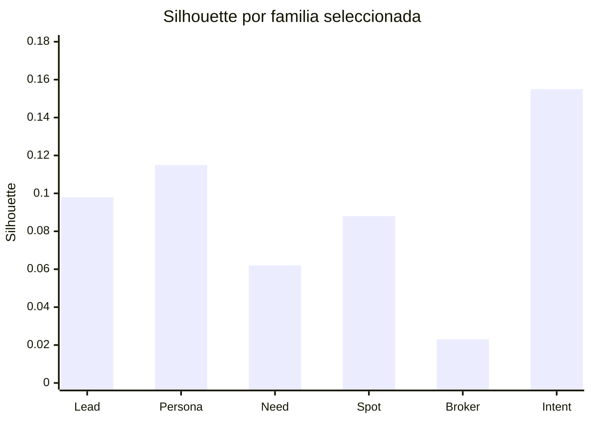
```mermaid
xychart-beta
    title "Silhouette por familia seleccionada"
    x-axis ["Lead","Persona","Need","Spot","Broker","Intent"]
    y-axis "Silhouette" 0 --> 0.18
    bar [0.098,0.115,0.062,0.088,0.023,0.155]
```

**Lectura:** `inquiry_intent` tiene la separación interna más clara; `broker` es mucho más débil por geometría de cluster.

**Fuente:** `experimentos/profile_clustering_v2/results/selected_clusterers.csv`.

---

## 8. Profile clustering v2 · estabilidad ARI

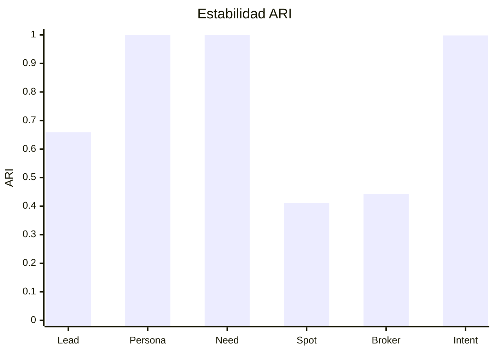
```mermaid
xychart-beta
    title "Estabilidad ARI"
    x-axis ["Lead","Persona","Need","Spot","Broker","Intent"]
    y-axis "ARI" 0 --> 1
    bar [0.659,1.000,1.000,0.410,0.443,0.998]
```

**Lectura:** Persona, Need e Intent son altamente reproducibles; Spot y Broker son considerablemente menos estables.

**Fuente:** `experimentos/profile_clustering_v2/results/selected_clusterers.csv`.

---

## 9. Profile clustering v2 · balance de clusters

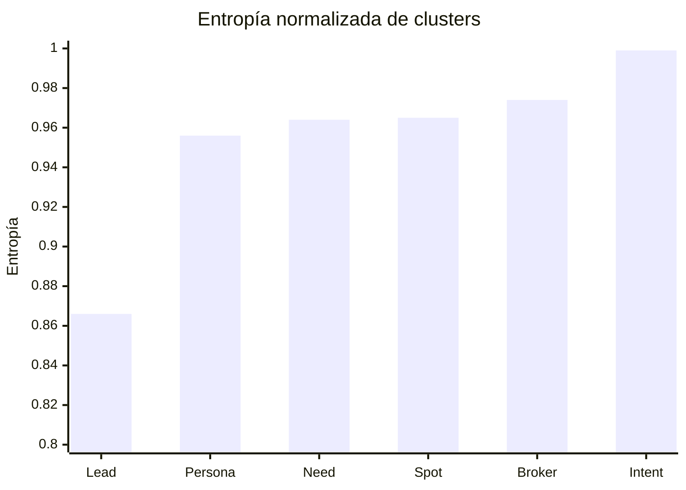
```mermaid
xychart-beta
    title "Entropía normalizada de clusters"
    x-axis ["Lead","Persona","Need","Spot","Broker","Intent"]
    y-axis "Entropía" 0.8 --> 1
    bar [0.866,0.956,0.964,0.965,0.974,0.999]
```

**Lectura:** pese a diferencias de separación/estabilidad, los clusterers seleccionados evitan particiones extremadamente desbalanceadas.

**Fuente:** `experimentos/profile_clustering_v2/results/selected_clusterers.csv`.

---

## 10. Profile clustering v2 · lift de combinaciones 3-entidades

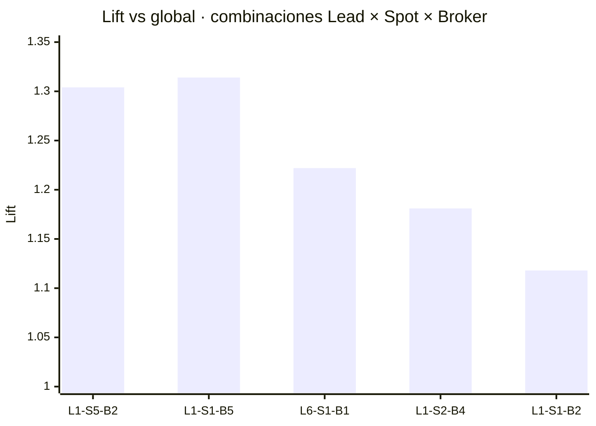
```mermaid
xychart-beta
    title "Lift vs global · combinaciones Lead × Spot × Broker"
    x-axis ["L1-S5-B2","L1-S1-B5","L6-S1-B1","L1-S2-B4","L1-S1-B2"]
    y-axis "Lift" 1.0 --> 1.35
    bar [1.304,1.314,1.222,1.181,1.118]
```

**Lectura:** algunas interacciones 3-entidades concentran señal superior al promedio, pero deben leerse junto con soporte muestral e intervalos.

**Fuente:** `experimentos/profile_clustering_v2/results/top_3entity_combinations.csv`.

---

## 11. Matching profiles v4 · jerarquía semántica

**CONCEPTUAL, respaldado por E008–E016**

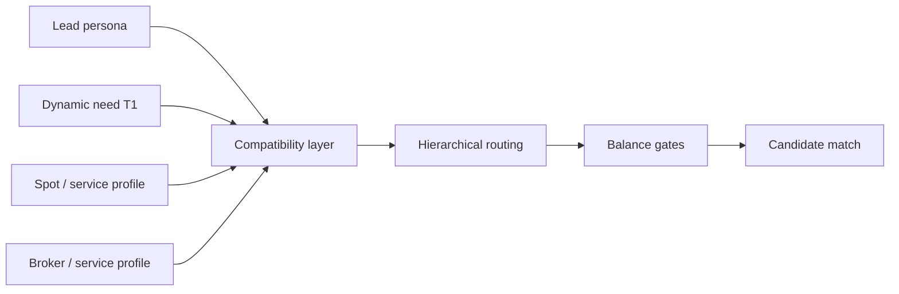
```mermaid
flowchart LR
    A[Lead persona] --> E[Compatibility layer]
    B[Dynamic need T1] --> E
    C[Spot / service profile] --> E
    D[Broker / service profile] --> E
    E --> F[Hierarchical routing]
    F --> G[Balance gates]
    G --> H[Candidate match]
```

**Fuente:** `experimentos/matching_profiles_v4/`.

---

## 12. Matching A/B v3 · auditoría de calidad de datos

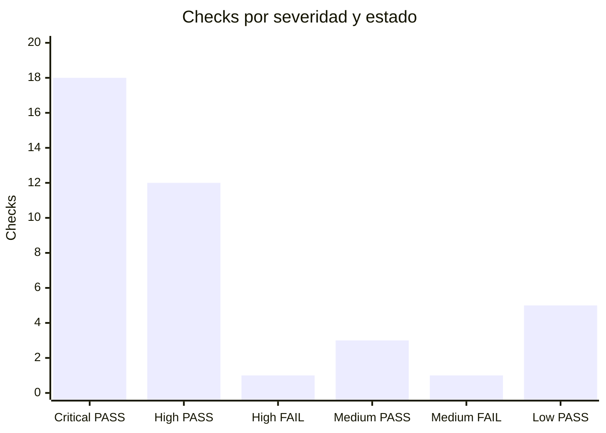
```mermaid
xychart-beta
    title "Checks por severidad y estado"
    x-axis ["Critical PASS","High PASS","High FAIL","Medium PASS","Medium FAIL","Low PASS"]
    y-axis "Checks" 0 --> 20
    bar [18,12,1,3,1,5]
```

**Lectura:** 38 de 40 checks pasan; quedan 2 fallos no críticos que deben conservarse visibles, no ocultarse detrás del resultado del modelo.

**Fuente:** `experimentos/matching_ab_v3/results/data_quality_summary.csv`.

---

## 13. Matching A/B v3 · delta de Average Precision

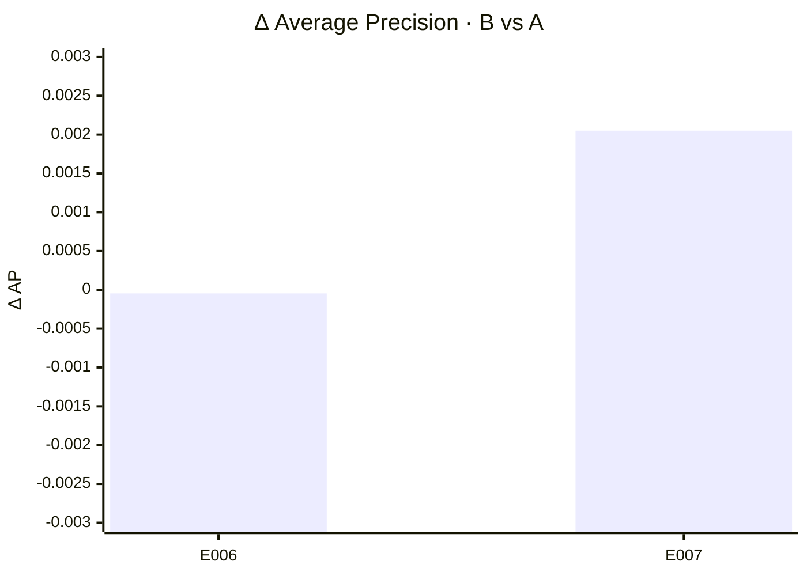
```mermaid
xychart-beta
    title "Δ Average Precision · B vs A"
    x-axis ["E006","E007"]
    y-axis "Δ AP" -0.003 --> 0.003
    bar [-0.000046,0.002051]
```

**Intervalos bootstrap:** E006 `[-0.00572, 0.00550]`; E007 `[-0.00960, 0.01294]`.

**Lectura:** ambos intervalos cruzan cero; la evidencia offline no justifica afirmar mejora estadísticamente concluyente.

**Fuente:** `experimentos/matching_ab_v3/results/bootstrap_deltas.csv`.

---

## 14. Matching A/B v3 · delta de Lift@10%

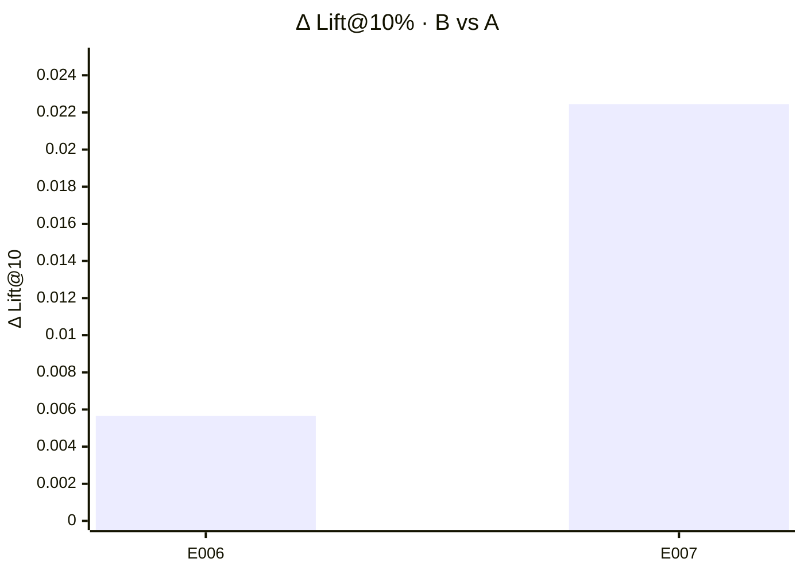
```mermaid
xychart-beta
    title "Δ Lift@10% · B vs A"
    x-axis ["E006","E007"]
    y-axis "Δ Lift@10" 0 --> 0.025
    bar [0.00565,0.02245]
```

**Intervalos bootstrap:** E006 `[-0.1268, 0.1241]`; E007 `[-0.1863, 0.2256]`.

**Lectura:** el punto estimado es positivo en ambos, pero la incertidumbre es mucho mayor que el efecto estimado.

**Fuente:** `experimentos/matching_ab_v3/results/bootstrap_deltas.csv`.

---

## 15. Modelo 3 · benchmark de Average Precision

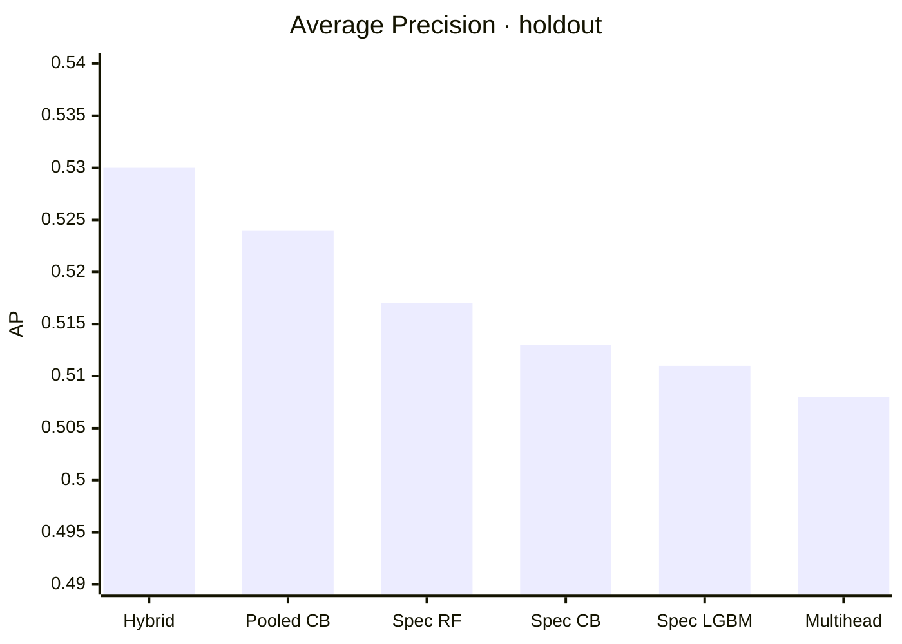
```mermaid
xychart-beta
    title "Average Precision · holdout"
    x-axis ["Hybrid","Pooled CB","Spec RF","Spec CB","Spec LGBM","Multihead"]
    y-axis "AP" 0.49 --> 0.54
    bar [0.530,0.524,0.517,0.513,0.511,0.508]
```

**Lectura:** el híbrido seleccionado por validación queda primero por AP; Multihead no domina el benchmark.

**Fuente:** `experimentos/modelo_3/benchmark_specialists/results/model_ranking.csv`.

---

## 16. Modelo 3 · benchmark de Lift@10%

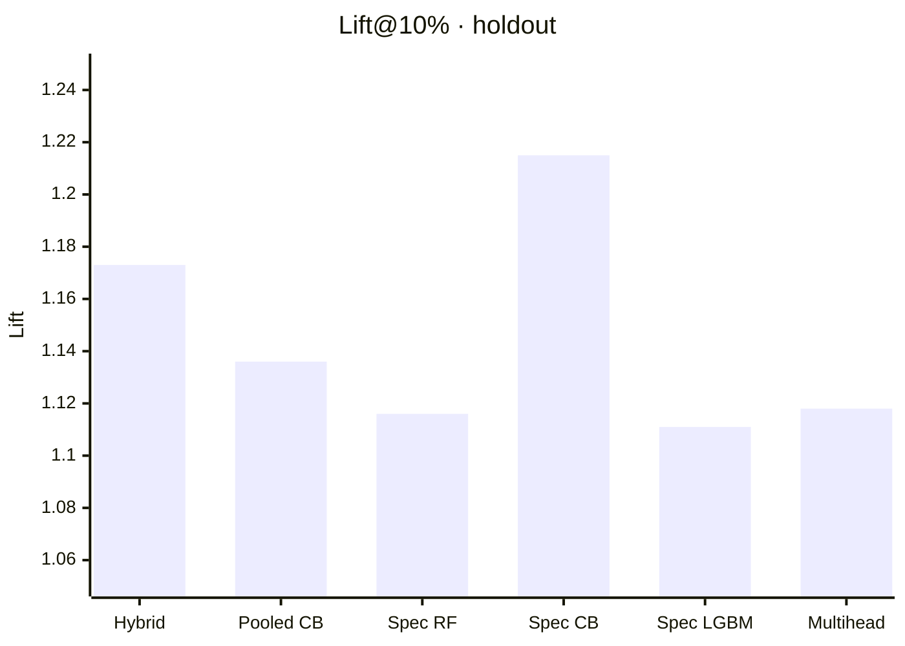
```mermaid
xychart-beta
    title "Lift@10% · holdout"
    x-axis ["Hybrid","Pooled CB","Spec RF","Spec CB","Spec LGBM","Multihead"]
    y-axis "Lift" 1.05 --> 1.25
    bar [1.173,1.136,1.116,1.215,1.111,1.118]
```

**Lectura:** Specialist CatBoost tiene el mayor lift puntual, mostrando que el ranking por AP y por lift operativo no es idéntico.

**Fuente:** `experimentos/modelo_3/benchmark_specialists/results/model_ranking.csv`.

---

## 17. Modelo 3 T2 · importancia por familia

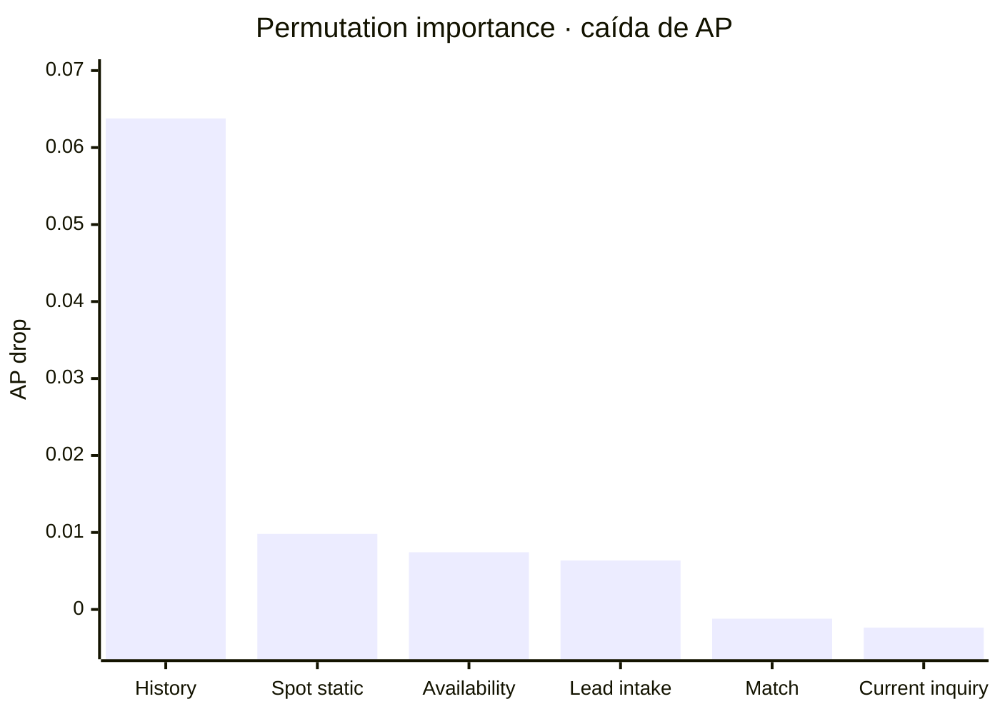
```mermaid
xychart-beta
    title "Permutation importance · caída de AP"
    x-axis ["History","Spot static","Availability","Lead intake","Match","Current inquiry"]
    y-axis "AP drop" -0.005 --> 0.07
    bar [0.06379,0.00982,0.00743,0.00636,-0.00120,-0.00235]
```

**Lectura:** `interaction_history` domina de forma muy marcada; la señal de contexto histórico explica mucho más que cualquier familia estática aislada.

**Fuente:** `experimentos/modelo_3/interpretabilidad_t2/results/family_importance.csv`.

---

## 18. Modelo 3 · rolling temporal CV

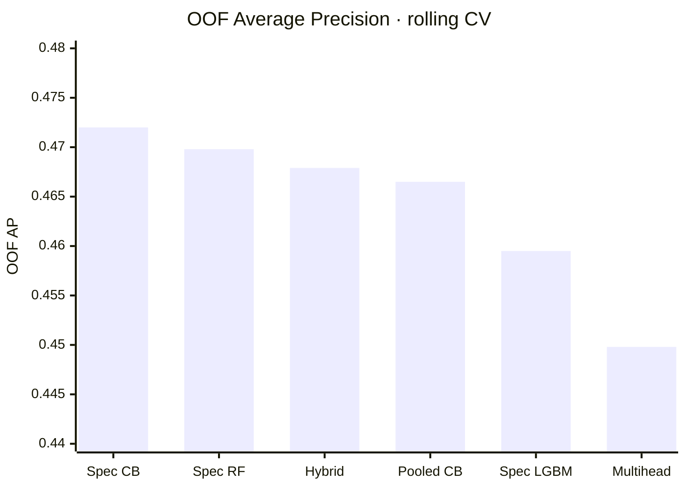
```mermaid
xychart-beta
    title "OOF Average Precision · rolling CV"
    x-axis ["Spec CB","Spec RF","Hybrid","Pooled CB","Spec LGBM","Multihead"]
    y-axis "OOF AP" 0.44 --> 0.48
    bar [0.4720,0.4698,0.4679,0.4665,0.4595,0.4498]
```

**Lectura:** al pasar de holdout a validación temporal OOF, Specialist CatBoost queda primero; esto es más fuerte como evidencia de generalización temporal.

**Fuente:** `experimentos/modelo_3/architecture_cv/results/oof_model_ranking.csv`.

---

## 19. Modelo 3 · trajectory / progression CV

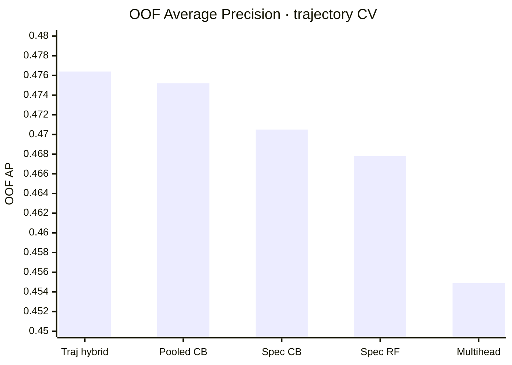
```mermaid
xychart-beta
    title "OOF Average Precision · trajectory CV"
    x-axis ["Traj hybrid","Pooled CB","Spec CB","Spec RF","Multihead"]
    y-axis "OOF AP" 0.45 --> 0.48
    bar [0.4764,0.4752,0.4705,0.4678,0.4549]
```

**Lectura:** la trayectoria aporta una mejora pequeña pero consistente en el mejor modelo frente al rolling CV sin esa representación.

**Fuente:** `experimentos/modelo_3/trajectory_cv/results/trajectory_model_ranking.csv`.

---

## 20. LLM inventory semantic audit · descubrimiento offline

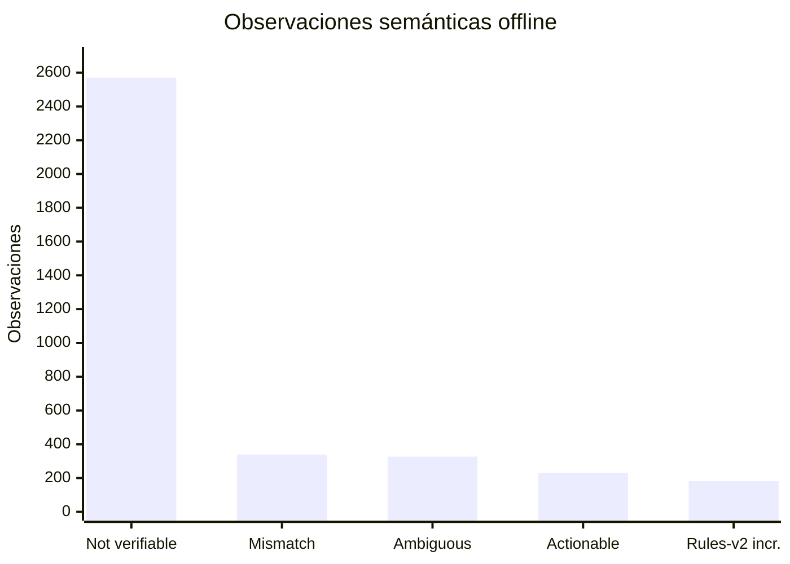
```mermaid
xychart-beta
    title "Observaciones semánticas offline"
    x-axis ["Not verifiable","Mismatch","Ambiguous","Actionable","Rules-v2 incr."]
    y-axis "Observaciones" 0 --> 2700
    bar [2570,339,327,230,182]
```

**Lectura:** el hallazgo principal no es que “el LLM resuelva todo”, sino que existe una clase concreta de inconsistencias semánticas accionables. El LLM todavía **no fue ejecutado** en esta evidencia y debe mantenerse explícitamente como pendiente.

**Fuente:** `experimentos/llm_inventory_quality/E015_llm_inventory_semantic_audit/results/offline_summary.json`.

---

# Cobertura lograda en Fase 1

| Tema | Visuales |
|---|---:|
| Auditoría de evidencia | 1 |
| Lead attention / response time | 2 |
| Geografía / LLM triage | 2 |
| Entity matching / clustering | 5 |
| Matching profiles / A-B / calidad | 4 |
| Modelo 3 / interpretabilidad / CV | 5 |
| LLM inventory quality | 1 |
| **Total** | **20** |

## Pendientes para Fase 2

La siguiente fase debería añadir, como mínimo: curvas PR/ROC, calibración, evolución por fold temporal, matrices de transición T0→T1, heatmaps de compatibilidad, tamaños/soporte de clusters, intervalos Wilson de mejores celdas, sensibilidad al balance, visual de completitud por tabla/campo, cobertura temporal de `availability` y `market_context`, y ejemplos visuales de errores semánticos del inventario.
