# Spot 2 · Evidencia visual · Fase 2

Esta segunda fase agrega **20 visualizaciones adicionales** y profundiza en incertidumbre, estabilidad temporal, cobertura de datos y soporte muestral. Con Fase 1 + Fase 2, el repositorio pasa a **40 piezas visuales** de evidencia.

> Regla de lectura: el lift puntual nunca se interpreta solo. Cuando existe, se acompaña de soporte `n`, intervalo Wilson, estabilidad temporal o cobertura de datos.

---

## 21. Availability · cobertura temporal

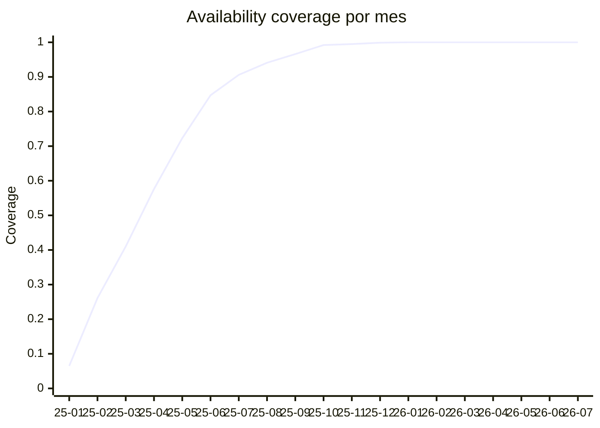
```mermaid
xychart-beta
    title "Availability coverage por mes"
    x-axis ["25-01","25-02","25-03","25-04","25-05","25-06","25-07","25-08","25-09","25-10","25-11","25-12","26-01","26-02","26-03","26-04","26-05","26-06","26-07"]
    y-axis "Coverage" 0 --> 1
    line [0.065,0.261,0.410,0.576,0.723,0.847,0.906,0.941,0.966,0.992,0.995,0.999,1,1,1,1,1,1,1]
```

**Lectura:** la tabla de disponibilidad tiene una rampa de cobertura muy marcada durante 2025. Desde enero de 2026 alcanza 100%, por lo que comparar periodos antiguos con recientes sin controlar cobertura puede inducir sesgo.

**Fuente:** `experimentos/matching_ab_v3/results/availability_coverage_by_month.csv`.

---

## 22. Availability · frescura del snapshot

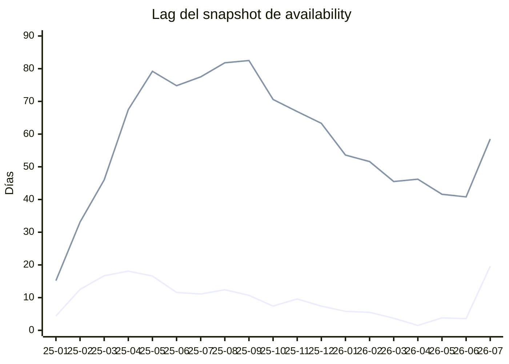
```mermaid
xychart-beta
    title "Lag del snapshot de availability"
    x-axis ["25-01","25-02","25-03","25-04","25-05","25-06","25-07","25-08","25-09","25-10","25-11","25-12","26-01","26-02","26-03","26-04","26-05","26-06","26-07"]
    y-axis "Días" 0 --> 90
    line [4.4,12.5,16.7,18.1,16.6,11.6,11.1,12.4,10.7,7.4,9.6,7.4,5.8,5.5,3.7,1.5,3.8,3.6,19.6]
    line [15.2,33.1,46.0,67.5,79.2,74.8,77.5,81.8,82.5,70.6,66.9,63.3,53.6,51.6,45.5,46.2,41.6,40.8,58.5]
```

**Series:** primera línea = mediana; segunda = P90.

**Lectura:** cobertura alta no equivale automáticamente a snapshot fresco. Julio de 2026 conserva 100% de cobertura pero la mediana sube a ~19.6 días.

**Fuente:** `availability_coverage_by_month.csv`.

---

## 23. Market context · cobertura exacta por mes

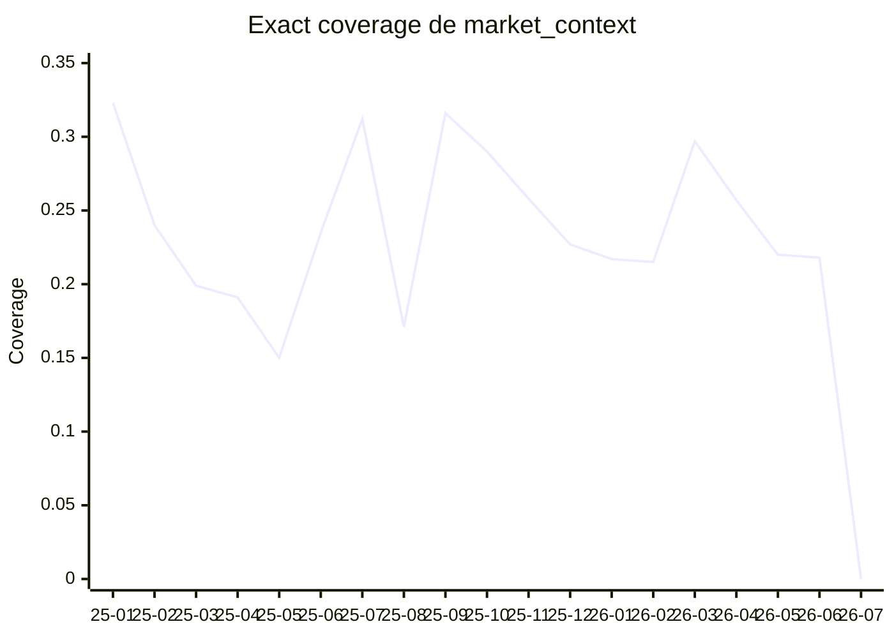
```mermaid
xychart-beta
    title "Exact coverage de market_context"
    x-axis ["25-01","25-02","25-03","25-04","25-05","25-06","25-07","25-08","25-09","25-10","25-11","25-12","26-01","26-02","26-03","26-04","26-05","26-06","26-07"]
    y-axis "Coverage" 0 --> 0.35
    line [0.323,0.240,0.199,0.191,0.150,0.235,0.312,0.171,0.316,0.290,0.258,0.227,0.217,0.215,0.297,0.257,0.220,0.218,0]
```

**Lectura:** a diferencia de `availability`, esta fuente nunca logra cobertura exacta alta y cae a 0 en julio de 2026. Es una señal clara para usar flags de contexto y evitar tratar ausencia de match como ausencia real de señal.

**Fuente:** `experimentos/matching_ab_v3/results/market_context_coverage_by_month.csv`.

---

## 24. Calidad de datos · columnas con menor completitud

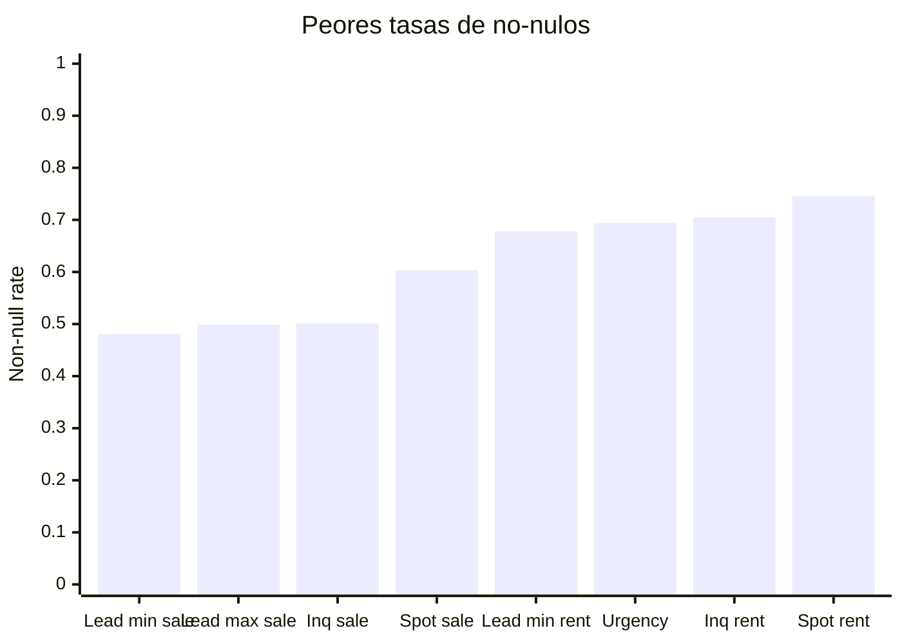
```mermaid
xychart-beta
    title "Peores tasas de no-nulos"
    x-axis ["Lead min sale","Lead max sale","Inq sale","Spot sale","Lead min rent","Urgency","Inq rent","Spot rent"]
    y-axis "Non-null rate" 0 --> 1
    bar [0.481,0.499,0.501,0.603,0.678,0.694,0.705,0.746]
```

**Lectura:** presupuesto de compra/venta es el bloque más incompleto. Esto justifica indicadores explícitos de disponibilidad de contexto y cautela al comparar modalidades rent/sale.

**Fuente:** `experimentos/matching_ab_v3/results/column_completeness.csv`.

---

## 25. Dynamic Need · transición T0→T1

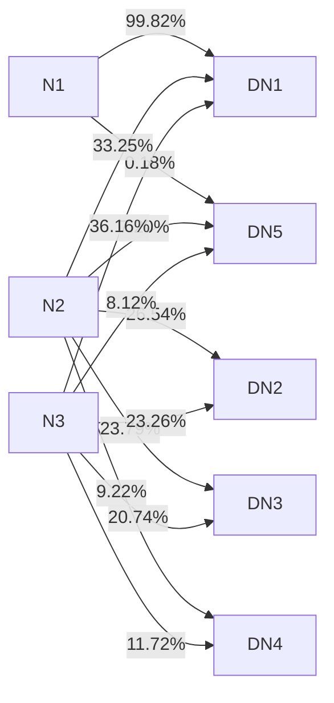
```mermaid
flowchart LR
    N1["N1"] -->|"99.82%"| D1["DN1"]
    N1 -->|"0.18%"| D5["DN5"]

    N2["N2"] -->|"33.25%"| D1
    N2 -->|"26.54%"| D2["DN2"]
    N2 -->|"23.79%"| D3["DN3"]
    N2 -->|"9.22%"| D4["DN4"]
    N2 -->|"7.20%"| D5

    N3["N3"] -->|"36.16%"| D1
    N3 -->|"23.26%"| D2
    N3 -->|"20.74%"| D3
    N3 -->|"11.72%"| D4
    N3 -->|"8.12%"| D5
```

**Lectura:** N1 prácticamente permanece en una sola necesidad dinámica, mientras que N2 y N3 se redistribuyen ampliamente cuando aparece información T1.

**Fuente:** `experimentos/matching_profiles_v4/results/need_t0_t1_transition_matrix.csv`.

---

## 26. Dynamic Need · concentración de la transición dominante

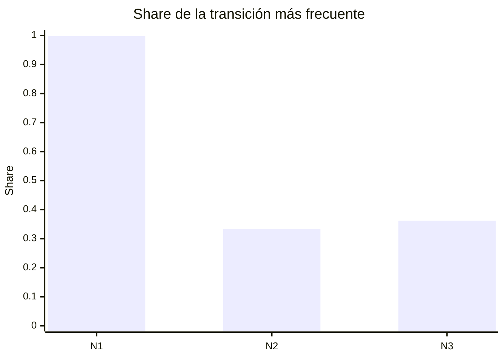
```mermaid
xychart-beta
    title "Share de la transición más frecuente"
    x-axis ["N1","N2","N3"]
    y-axis "Share" 0 --> 1
    bar [0.998,0.333,0.362]
```

**Lectura:** este gráfico hace visible por qué T1 agrega tanto valor para N2/N3: su estado inicial es mucho menos determinista que N1.

**Fuente:** `need_t0_t1_transition_matrix.csv`.

---

## 27. Matching Profiles v4 · separación interna

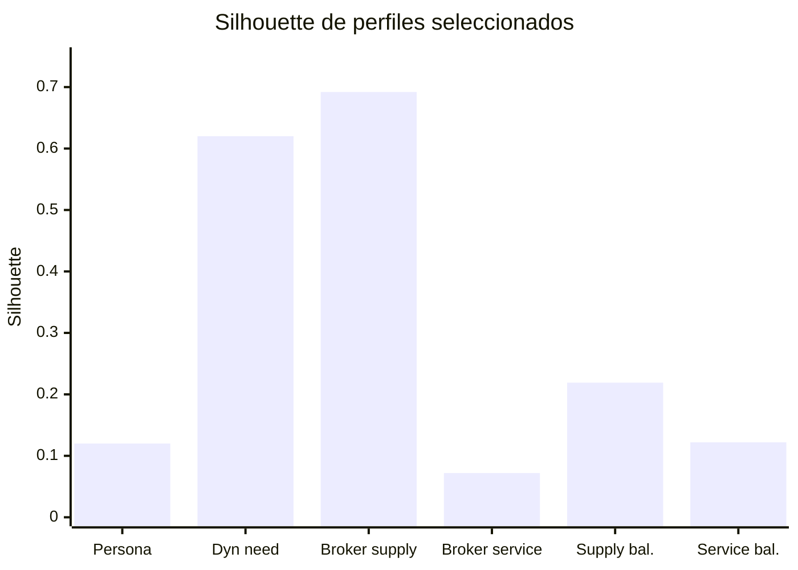
```mermaid
xychart-beta
    title "Silhouette de perfiles seleccionados"
    x-axis ["Persona","Dyn need","Broker supply","Broker service","Supply bal.","Service bal."]
    y-axis "Silhouette" 0 --> 0.75
    bar [0.120,0.620,0.692,0.072,0.219,0.122]
```

**Lectura:** Dynamic Need y Broker Supply separan muy bien geométricamente; Broker Service requiere más cautela.

**Fuente:** `experimentos/matching_profiles_v4/results/selected_clusterers.csv`.

---

## 28. Matching Profiles v4 · estabilidad ARI

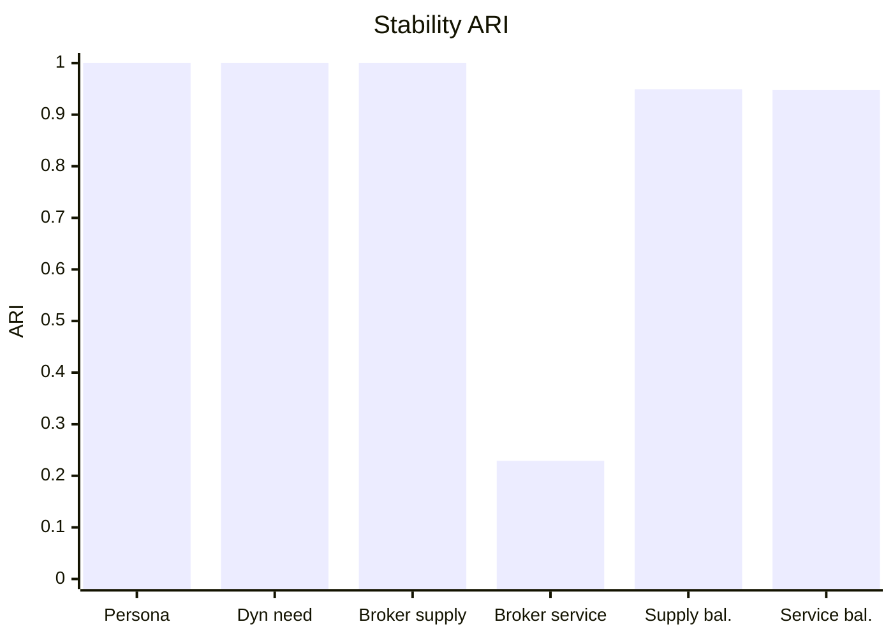
```mermaid
xychart-beta
    title "Stability ARI"
    x-axis ["Persona","Dyn need","Broker supply","Broker service","Supply bal.","Service bal."]
    y-axis "ARI" 0 --> 1
    bar [1.000,1.000,1.000,0.229,0.949,0.948]
```

**Lectura:** el perfil de Broker Service original es inestable (ARI ~0.23). La variante balanceada sacrifica algo de separación, pero eleva la reproducibilidad a ~0.95.

**Fuente:** `selected_clusterers.csv`.

---

## 29. Broker profiles · trade-off de concentración

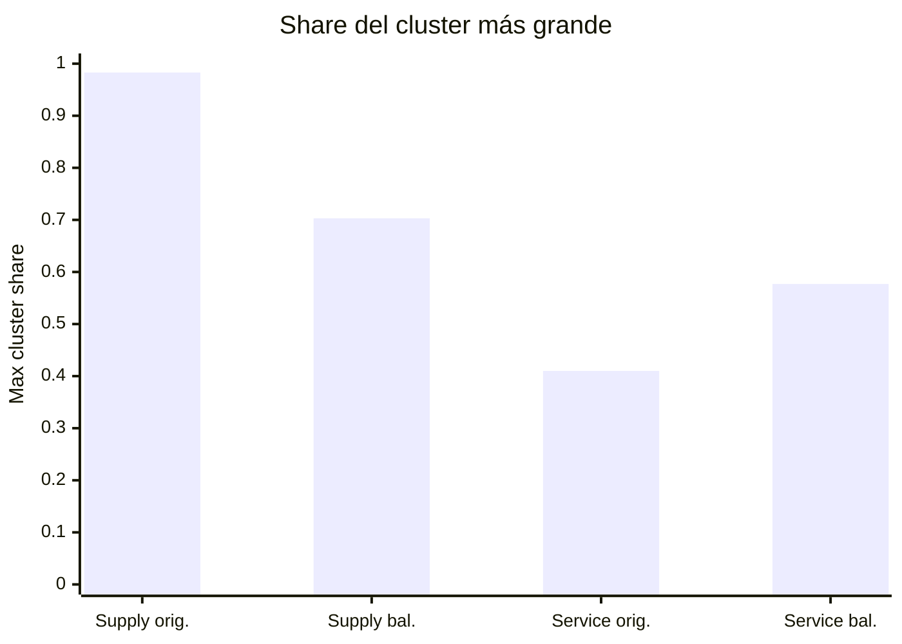
```mermaid
xychart-beta
    title "Share del cluster más grande"
    x-axis ["Supply orig.","Supply bal.","Service orig.","Service bal."]
    y-axis "Max cluster share" 0 --> 1
    bar [0.983,0.703,0.410,0.577]
```

**Lectura:** Broker Supply original colapsa 98.3% de los brokers en un cluster. La variante balanceada reduce esa concentración, aunque aún falla el gate de balance por el cluster minoritario.

**Fuente:** `selected_clusterers.csv`.

---

## 30. Service matching · lift de mejores celdas

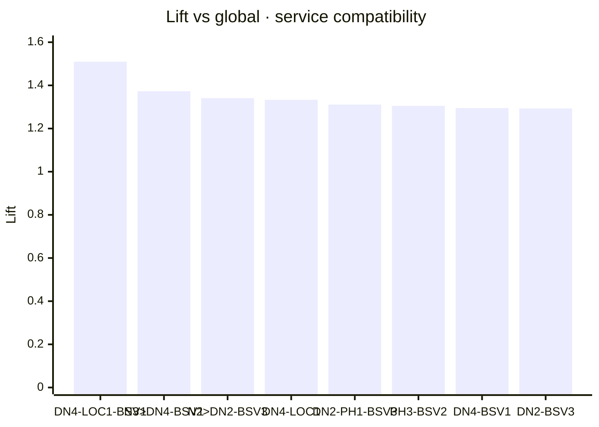
```mermaid
xychart-beta
    title "Lift vs global · service compatibility"
    x-axis ["DN4-LOC1-BSV1","N3>DN4-BSV1","N2>DN2-BSV3","DN4-LOC1","DN2-PH1-BSV3","PH3-BSV2","DN4-BSV1","DN2-BSV3"]
    y-axis "Lift" 0 --> 1.6
    bar [1.510,1.373,1.341,1.333,1.311,1.305,1.295,1.293]
```

**Lectura:** la mejor celda supera 1.5× el baseline global.

**Fuente:** `experimentos/matching_profiles_v4/results/top_service_compatibility_cells.csv`.

---

## 31. Service matching · lift conservador (Wilson lower bound)

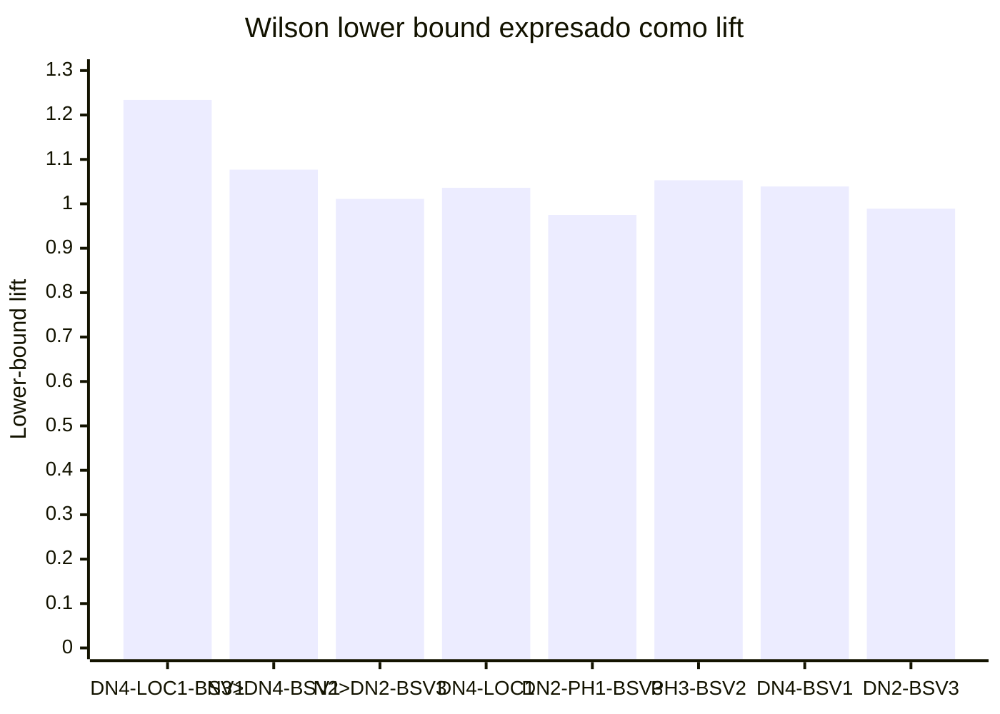
```mermaid
xychart-beta
    title "Wilson lower bound expresado como lift"
    x-axis ["DN4-LOC1-BSV1","N3>DN4-BSV1","N2>DN2-BSV3","DN4-LOC1","DN2-PH1-BSV3","PH3-BSV2","DN4-BSV1","DN2-BSV3"]
    y-axis "Lower-bound lift" 0 --> 1.3
    bar [1.234,1.077,1.011,1.036,0.975,1.053,1.039,0.989]
```

**Lectura:** sólo algunas celdas conservan un lower bound >1.0. Éstas son más defendibles que las que destacan sólo por el estimador puntual.

**Fuente:** `top_service_compatibility_cells.csv`.

---

## 32. Service matching · soporte muestral de las mejores celdas

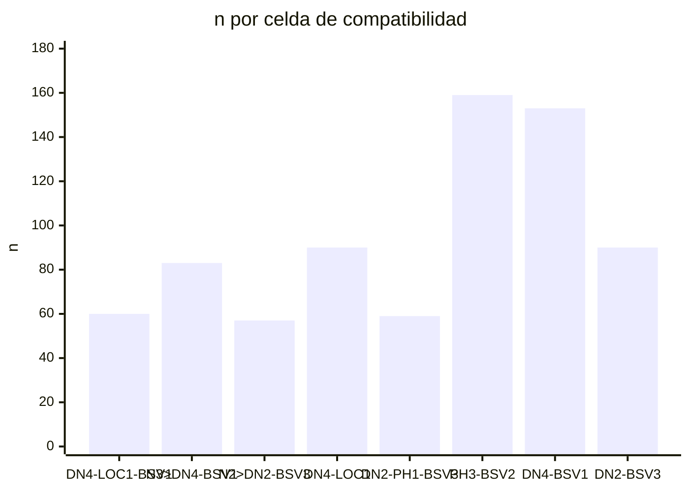
```mermaid
xychart-beta
    title "n por celda de compatibilidad"
    x-axis ["DN4-LOC1-BSV1","N3>DN4-BSV1","N2>DN2-BSV3","DN4-LOC1","DN2-PH1-BSV3","PH3-BSV2","DN4-BSV1","DN2-BSV3"]
    y-axis "n" 0 --> 180
    bar [60,83,57,90,59,159,153,90]
```

**Lectura:** PH3×BSV2 y DN4×BSV1 tienen mucho mayor soporte que varias celdas de lift más alto. El ranking operativo debe considerar ambos ejes.

**Fuente:** `top_service_compatibility_cells.csv`.

---

## 33. Entity Profile Match · incertidumbre de las mejores combinaciones

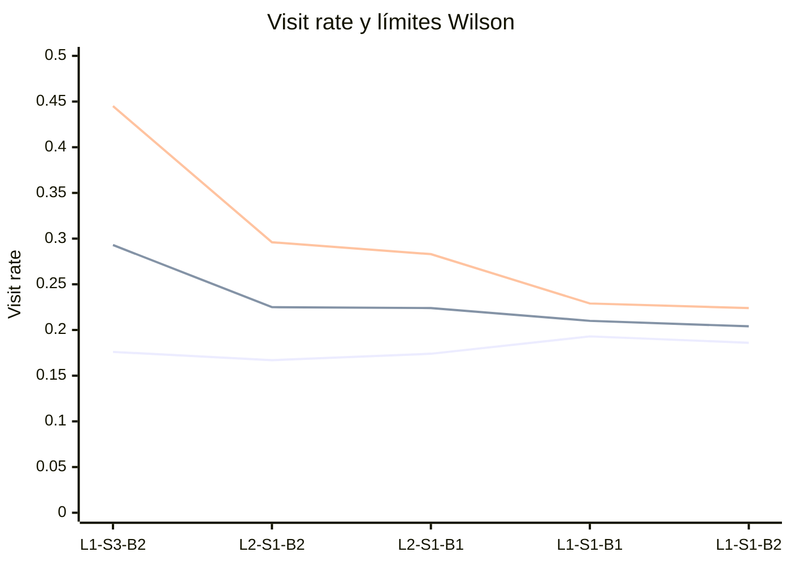
```mermaid
xychart-beta
    title "Visit rate y límites Wilson"
    x-axis ["L1-S3-B2","L2-S1-B2","L2-S1-B1","L1-S1-B1","L1-S1-B2"]
    y-axis "Visit rate" 0 --> 0.5
    line [0.176,0.167,0.174,0.193,0.186]
    line [0.293,0.225,0.224,0.210,0.204]
    line [0.445,0.296,0.283,0.229,0.224]
```

**Series:** Wilson low → estimación puntual → Wilson high.

**Lectura:** L1-S3-B2 tiene la tasa puntual más alta, pero su intervalo es mucho más ancho por `n=41`. Las celdas L1-S1-B1/B2 son menos espectaculares y mucho más precisas.

**Fuente:** `experimentos/entity_profile_match/results/top_combinations.csv`.

---

## 34. Modelo 3 · AP promedio en rolling temporal CV

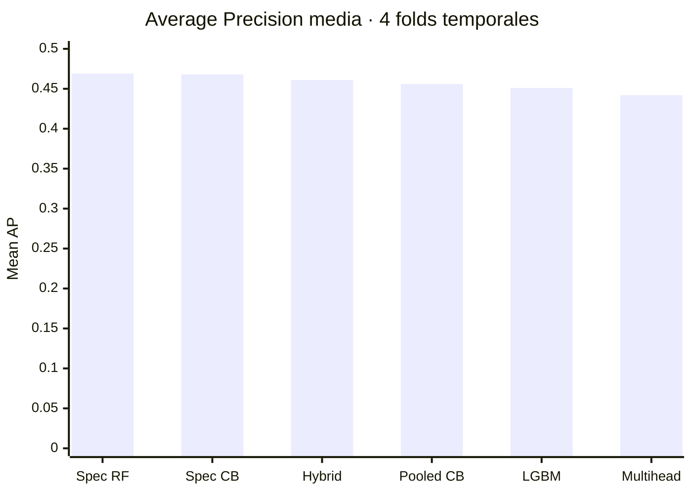
```mermaid
xychart-beta
    title "Average Precision media · 4 folds temporales"
    x-axis ["Spec RF","Spec CB","Hybrid","Pooled CB","LGBM","Multihead"]
    y-axis "Mean AP" 0 --> 0.5
    bar [0.469,0.468,0.461,0.456,0.451,0.442]
```

**Lectura:** Specialist RF y Specialist CatBoost quedan prácticamente empatados en media; la ventaja sobre Hybrid es pequeña.

**Fuente:** `experimentos/modelo_3/architecture_cv/results/fold_metric_summary.csv`.

---

## 35. Modelo 3 · variabilidad de AP entre folds

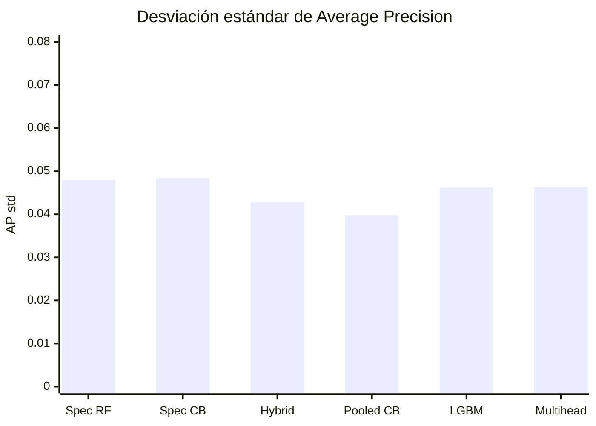
```mermaid
xychart-beta
    title "Desviación estándar de Average Precision"
    x-axis ["Spec RF","Spec CB","Hybrid","Pooled CB","LGBM","Multihead"]
    y-axis "AP std" 0 --> 0.08
    bar [0.0480,0.0484,0.0428,0.0398,0.0462,0.0463]
```

**Lectura:** ninguna arquitectura domina también en estabilidad. Pooled CatBoost tiene menor dispersión entre folds, aunque no la mejor media.

**Fuente:** `fold_metric_summary.csv`.

---

## 36. Modelo 3 · T2 es donde más señal aparece

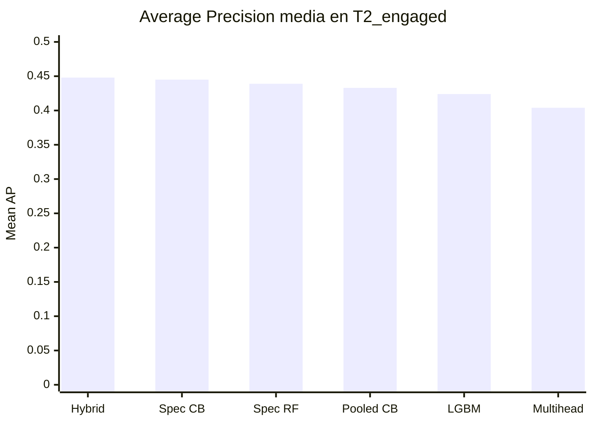
```mermaid
xychart-beta
    title "Average Precision media en T2_engaged"
    x-axis ["Hybrid","Spec CB","Spec RF","Pooled CB","LGBM","Multihead"]
    y-axis "Mean AP" 0 --> 0.5
    bar [0.448,0.445,0.439,0.433,0.424,0.404]
```

**Lectura:** T2 sigue siendo el estado con mayor capacidad discriminativa para las mejores arquitecturas; esto es coherente con la importancia dominante del historial de interacción encontrada en interpretabilidad.

**Fuente:** `fold_metric_summary.csv` + EV-004.

---

## 37. Modelo 3 · Lift@10% promedio en rolling CV

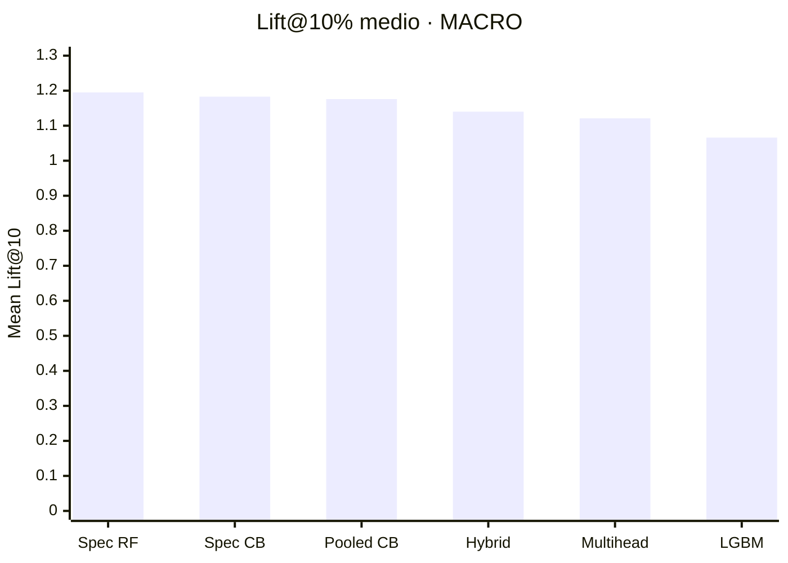
```mermaid
xychart-beta
    title "Lift@10% medio · MACRO"
    x-axis ["Spec RF","Spec CB","Pooled CB","Hybrid","Multihead","LGBM"]
    y-axis "Mean Lift@10" 0 --> 1.3
    bar [1.195,1.183,1.176,1.140,1.121,1.066]
```

**Lectura:** Specialist RF lidera en lift promedio temporal, aunque los intervalos/variación por fold siguen siendo relevantes para una decisión final.

**Fuente:** `fold_metric_summary.csv`.

---

## 38. Trajectory CV · AP por fold

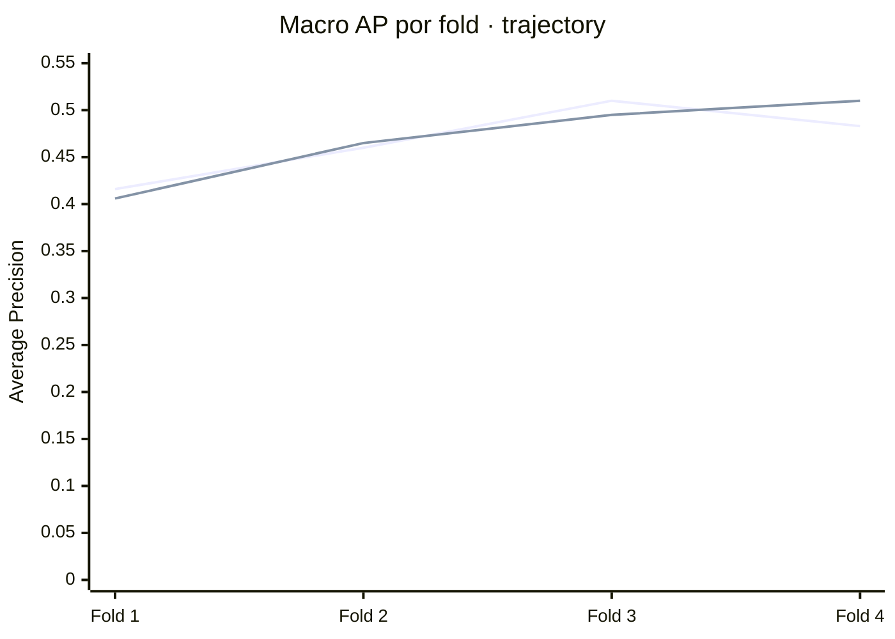
```mermaid
xychart-beta
    title "Macro AP por fold · trajectory"
    x-axis ["Fold 1","Fold 2","Fold 3","Fold 4"]
    y-axis "Average Precision" 0 --> 0.55
    line [0.416,0.460,0.510,0.483]
    line [0.406,0.465,0.495,0.510]
```

**Series:** primera = `trajectory_validation_hybrid`; segunda = `pooled_catboost_trajectory`.

**Lectura:** el ganador cambia por fold. Hybrid lidera en 1 y 3; Pooled CatBoost lo hace en 2 y 4. Esto refuerza el uso de selección temporal/híbrida en vez de declarar un único modelo universal.

**Fuente:** `experimentos/modelo_3/trajectory_cv/results/fold_metrics.csv`.

---

## 39. LLM inventory · flags deterministas por sector

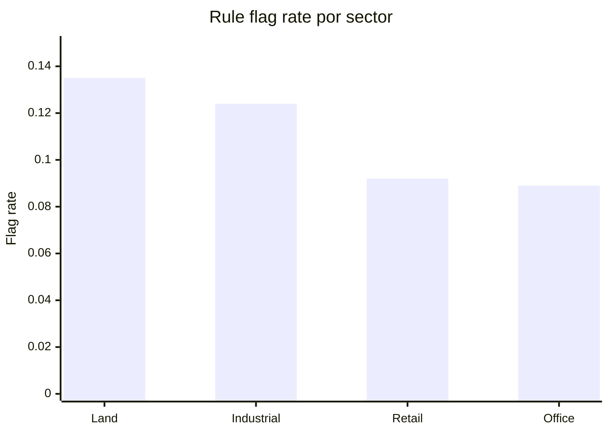
```mermaid
xychart-beta
    title "Rule flag rate por sector"
    x-axis ["Land","Industrial","Retail","Office"]
    y-axis "Flag rate" 0 --> 0.15
    bar [0.135,0.124,0.092,0.089]
```

**Lectura:** Land e Industrial concentran más anomalías detectables por reglas. Es un buen candidato para estratificar la muestra de evaluación del LLM.

**Fuente:** `experimentos/llm_inventory_quality/E015_llm_inventory_semantic_audit/results/rule_flags_by_sector.csv`.

---

## 40. LLM inventory · boilerplate más repetido

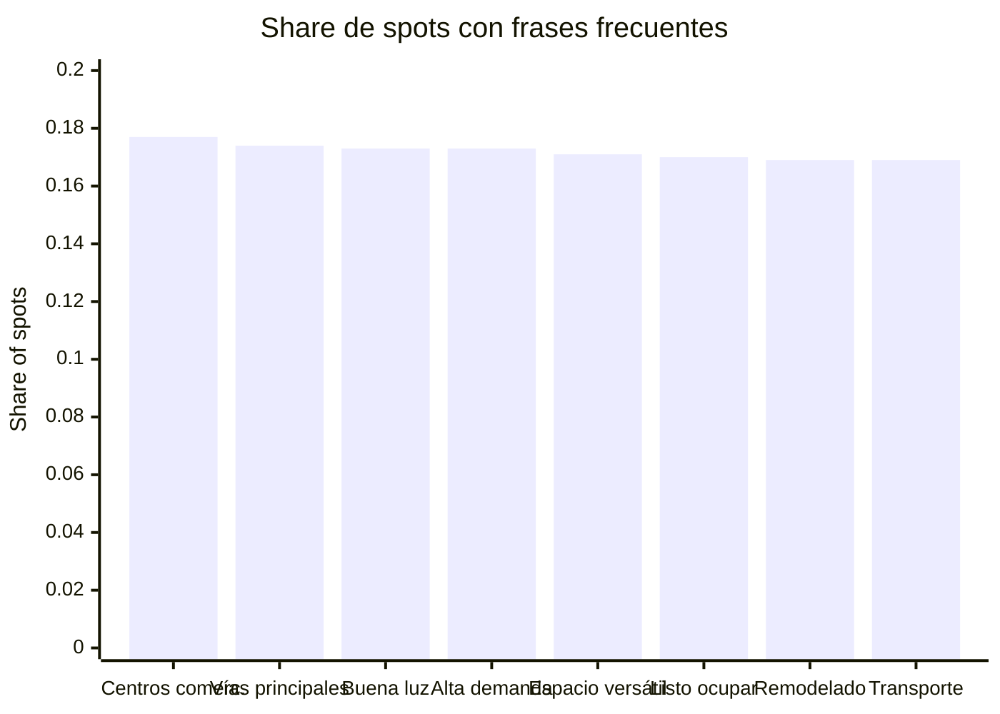
```mermaid
xychart-beta
    title "Share de spots con frases frecuentes"
    x-axis ["Centros comerc.","Vías principales","Buena luz","Alta demanda","Espacio versátil","Listo ocupar","Remodelado","Transporte"]
    y-axis "Share of spots" 0 --> 0.2
    bar [0.177,0.174,0.173,0.173,0.171,0.170,0.169,0.169]
```

**Lectura:** varias frases aparecen en ~17% del inventario, señal de copy reutilizado. Esto explica por qué longitud o bag-of-words simple no basta para auditar consistencia semántica: el problema está en si la afirmación es compatible con los campos estructurados.

**Fuente:** `experimentos/llm_inventory_quality/E015_llm_inventory_semantic_audit/results/description_sentence_counts.csv`.

---

# Cobertura de Fase 2

| Bloque | Visuales |
|---|---:|
| Cobertura temporal / data quality | 4 |
| T0→T1 / Dynamic Need | 2 |
| Clustering y balance de perfiles | 3 |
| Matching / incertidumbre / soporte | 4 |
| Modelo 3 / rolling + trajectory CV | 5 |
| LLM inventory | 2 |
| **Total** | **20** |

## Qué ya queda bien cubierto tras 40 visuales

- **Clustering:** separación, estabilidad, balance y combinaciones.
- **Matching:** lift, lower bound, soporte e incertidumbre.
- **Modelo 3:** benchmark, interpretabilidad, rolling CV, trajectory CV y variabilidad entre folds.
- **T0/T1:** transición y ganancia de información dinámica.
- **Calidad de datos:** completitud, cobertura y frescura temporal.
- **LLM:** arquitectura de triage, descubrimiento semántico, sectorización y boilerplate.
- **A/B:** deltas offline e incertidumbre bootstrap.

## Pendientes recomendados para Fase 3

1. Curvas PR completas por modelo/stage usando OOF predictions.
2. Reliability/calibration curves por stage.
3. Heatmaps reales de compatibilidad Dynamic Need × Broker Service y Need Transition × Physical.
4. Distribución de tamaños de cluster completa.
5. Curvas de sensibilidad a `k` y método.
6. Drift temporal de positive rate y AP por stage.
7. Ejemplos concretos de falsos positivos/falsos negativos del semantic audit.
8. Un **visual executive summary** de 1 página que conecte los mejores hallazgos del repositorio.
