# Visualizaciones Fase 3 — curvas, CV temporal y heatmaps reales

Esta fase materializa **19 imágenes SVG reales** a partir de resultados empíricos ya versionados. No sustituye las métricas tabulares: las hace inspeccionables visualmente.

## 1. Precision–Recall por stage

### T0
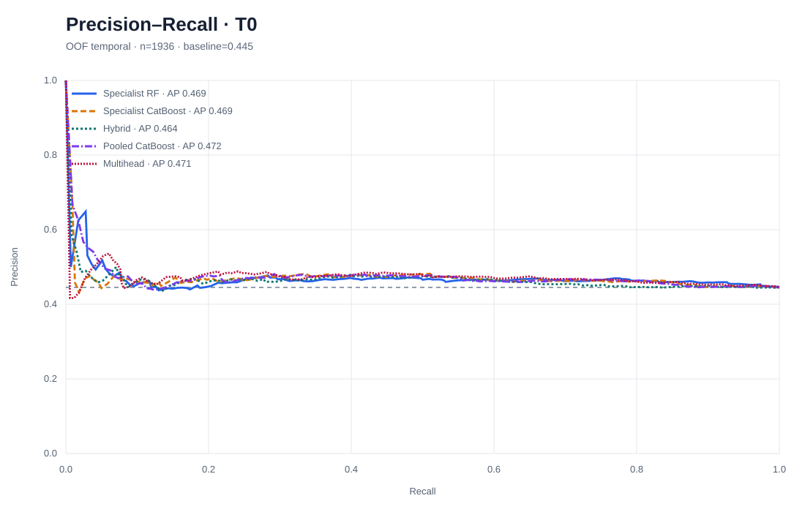

Fuente: `modelo_3/architecture_cv/results/oof_predictions.csv`.

### T1
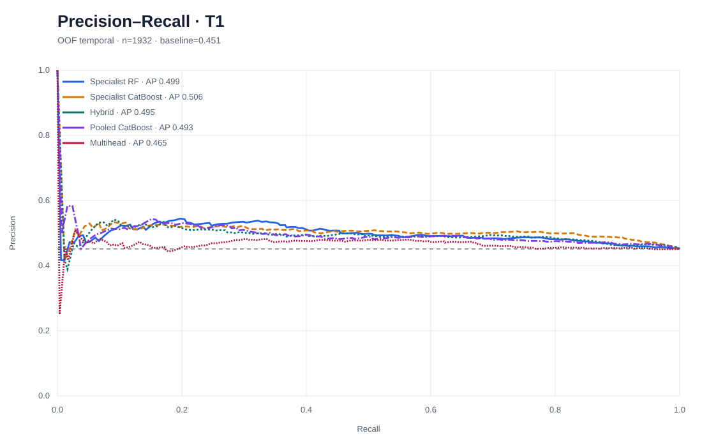

### T2
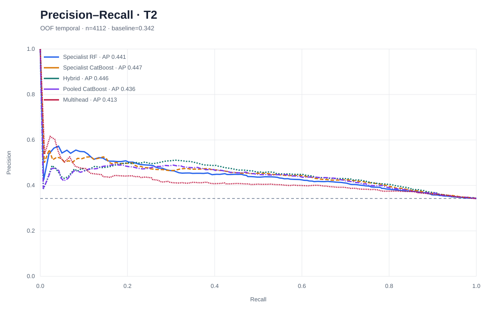

---

## 2. ROC por stage

### T0
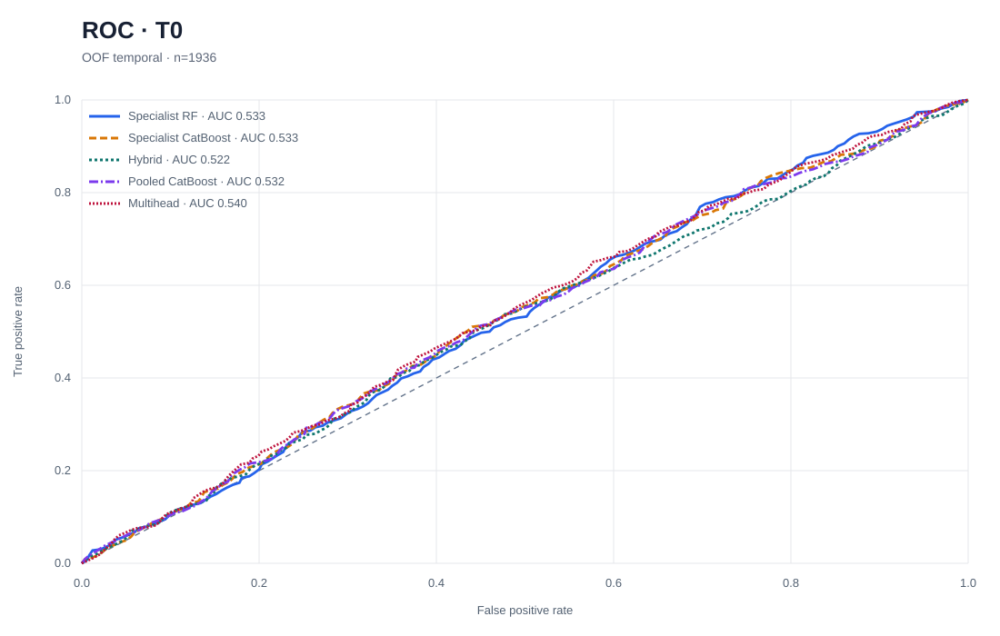

### T1
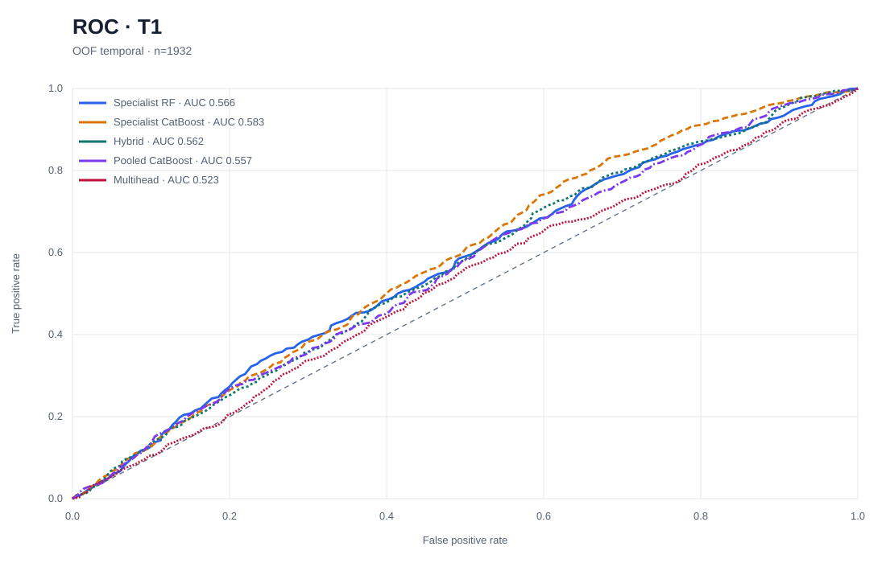

### T2
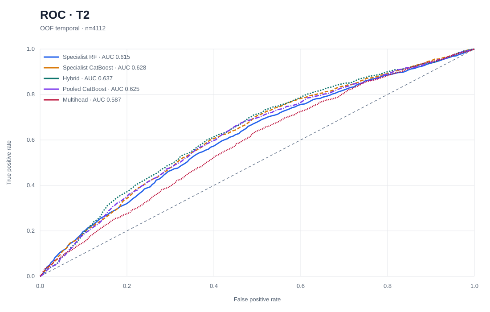

Fuente: `modelo_3/architecture_cv/results/oof_predictions.csv`.

---

## 3. Calibration / reliability

### T0
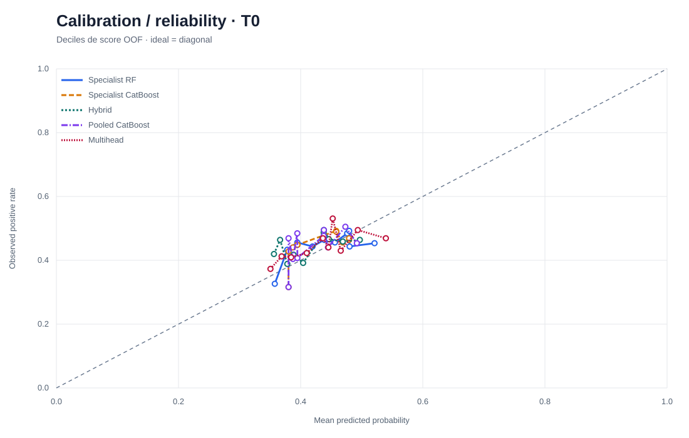

### T1
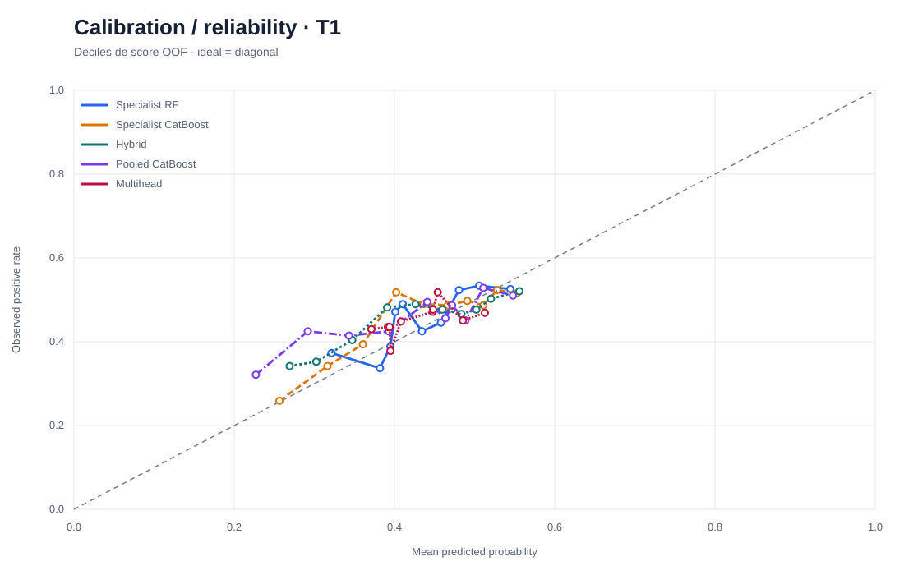

### T2
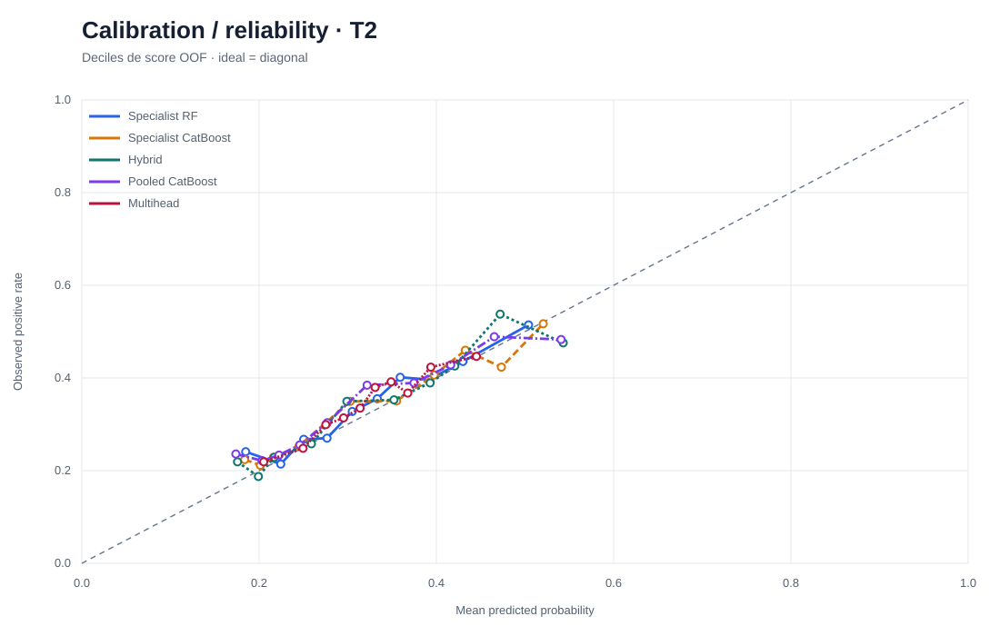

Las curvas usan deciles de score OOF y comparan contra la diagonal ideal.

---

## 4. Lift y cumulative gains

### T0

### T1

### T2

Cada imagen muestra gains acumulados y lift acumulado sobre el ranking OOF.

---

## 5. Average Precision por fold temporal

### Rolling temporal CV
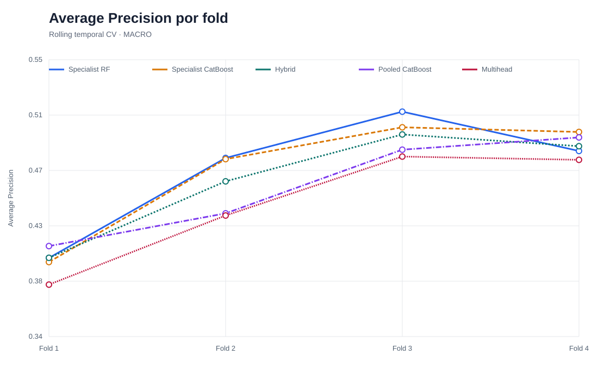

Fuente: `modelo_3/architecture_cv/results/fold_metrics.csv`.

### Trajectory temporal CV
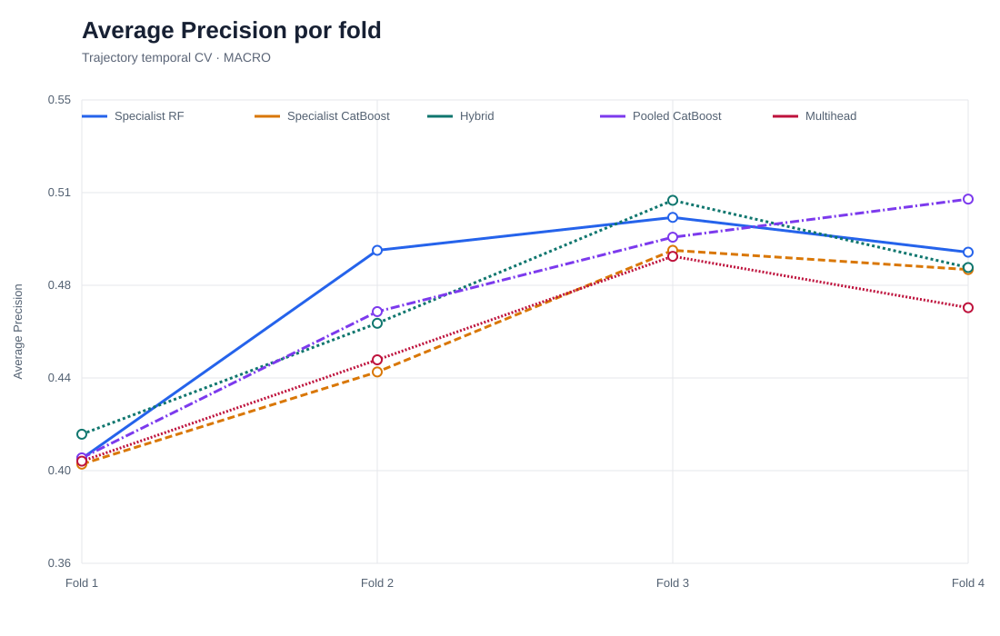

Fuente: `modelo_3/trajectory_cv/results/fold_metrics.csv`.

---

## 6. Lift@10% por fold temporal

### Rolling temporal CV
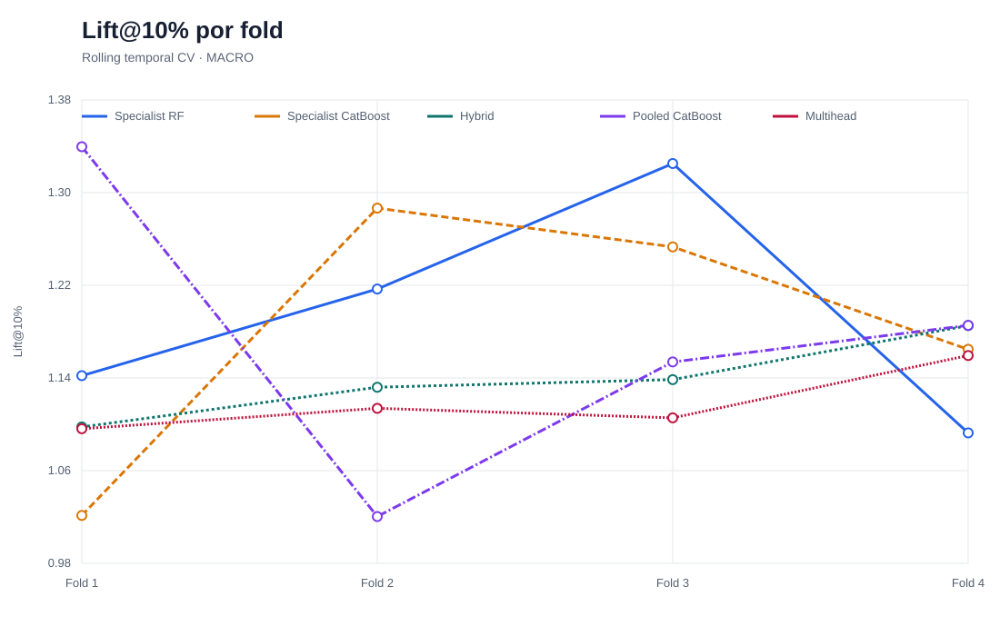

### Trajectory temporal CV
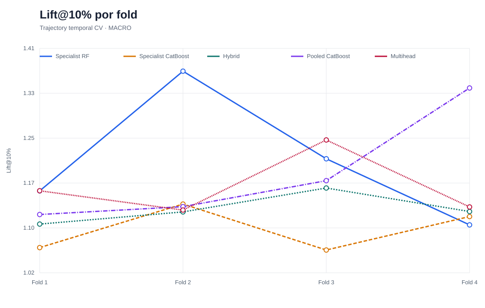

---

## 7. T0 → T1 transition heatmap

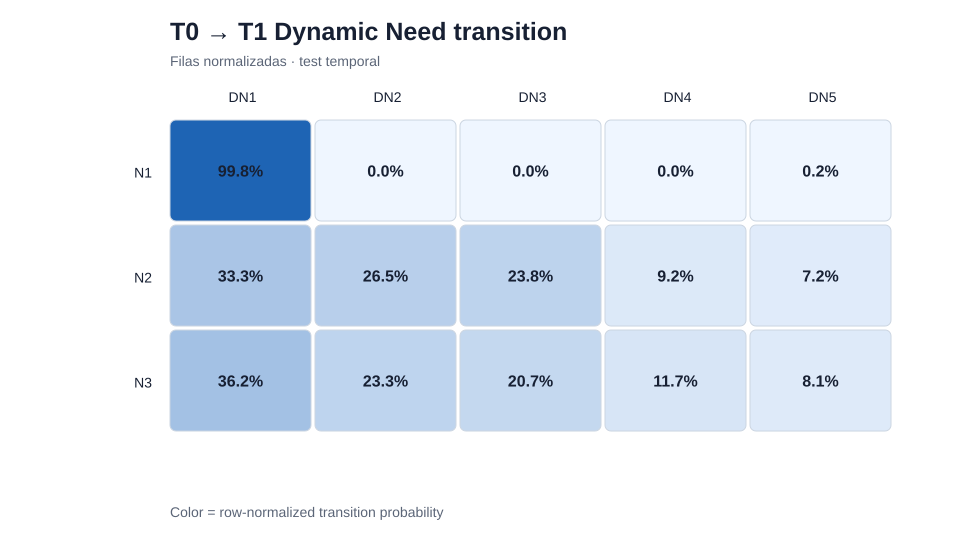

Fuente: `matching_profiles_v4/results/need_t0_t1_transition_matrix.csv`.

La intensidad representa probabilidad de transición normalizada por perfil T0.

---

## 8. Dynamic Need × Broker Service

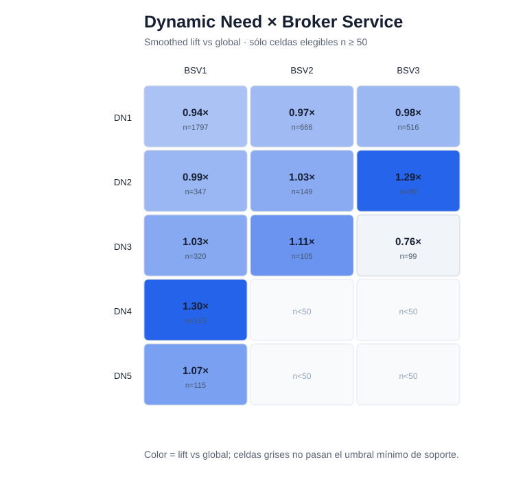

Fuente: `matching_profiles_v4/results/top_service_compatibility_cells.csv`.

- Color: lift suavizado vs tasa global.
- Anotación: lift y soporte `n`.
- Celda gris: combinación con soporte menor al gate `n < 50`; no se interpreta como lift 0.

---

## 9. Need Transition × Physical Profile

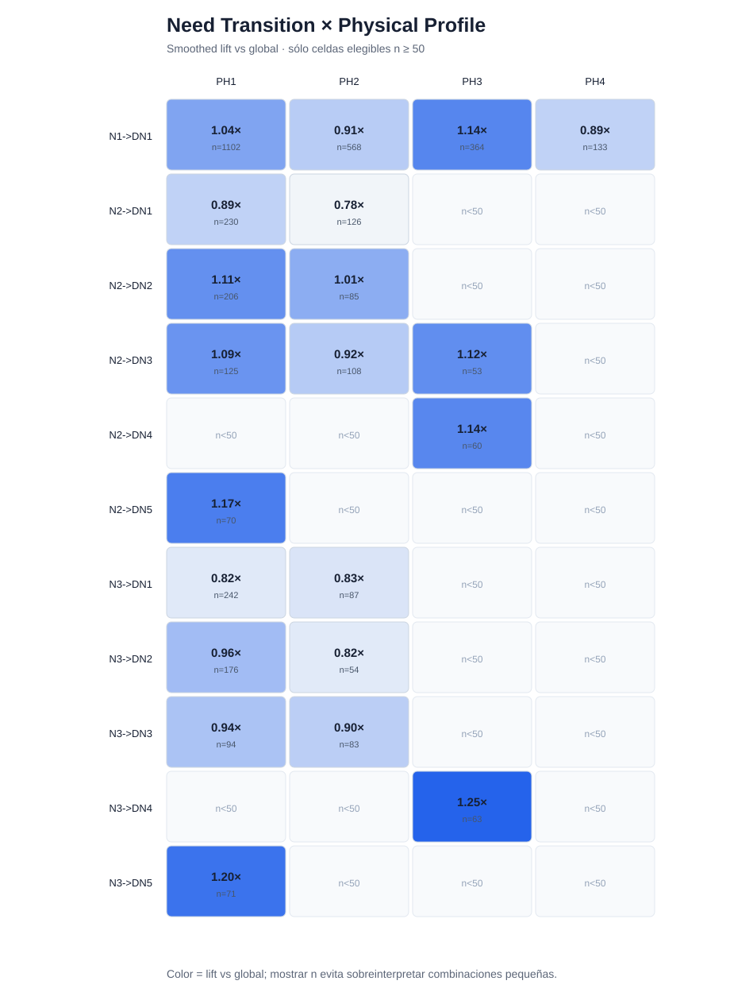

Fuente: `matching_profiles_v4/results/top_compatibility_cells.csv`.

- Color: lift suavizado vs tasa global.
- Anotación: lift y soporte `n`.
- Celdas sin soporte mínimo permanecen explícitamente como `n < 50`.

---

## Modelos comparados

Las curvas de Modelo 3 comparan:

1. Specialist Random Forest.
2. Specialist CatBoost.
3. Validation-selected Hybrid.
4. Pooled CatBoost.
5. Multihead.

Las curvas PR, ROC, calibration y lift/gains se calculan sobre **predicciones OOF temporales**, no desde métricas agregadas.

## Alcance

Estas figuras son evidencia descriptiva/predictiva del backtest. No convierten los resultados offline en evidencia causal ni eliminan las caveats registradas en EV-011, EV-012 y EV-013.
