# Visualizaciones Fase 4 — Robustez, drift y auditabilidad semántica

Esta fase agrega **12 imágenes SVG reales** para responder preguntas de robustez que quedaban abiertas después de PR/ROC/calibración/lift.

## 1. Sensibilidad de Dynamic Need a algoritmo y k

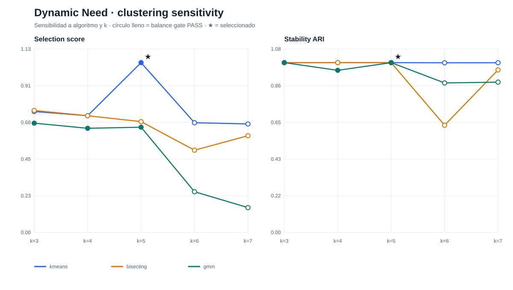

Fuente: `matching_profiles_v4/results/clustering_benchmark.csv`.

Muestra simultáneamente:
- selection score;
- stability ARI;
- sensibilidad a `k=3..7`;
- algoritmo;
- balance gate;
- configuración finalmente seleccionada.

---

## 2. Sensibilidad de Broker Service Balanced

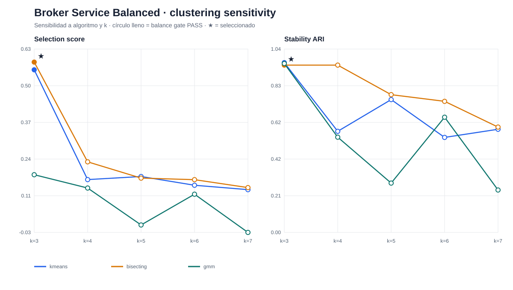

Fuente: `matching_profiles_v4/results/clustering_benchmark.csv`.

Este visual hace explícito el trade-off entre separación, estabilidad y balance que justificó preferir la representación balanceada.

---

## 3. Tamaños de clusters de los perfiles core

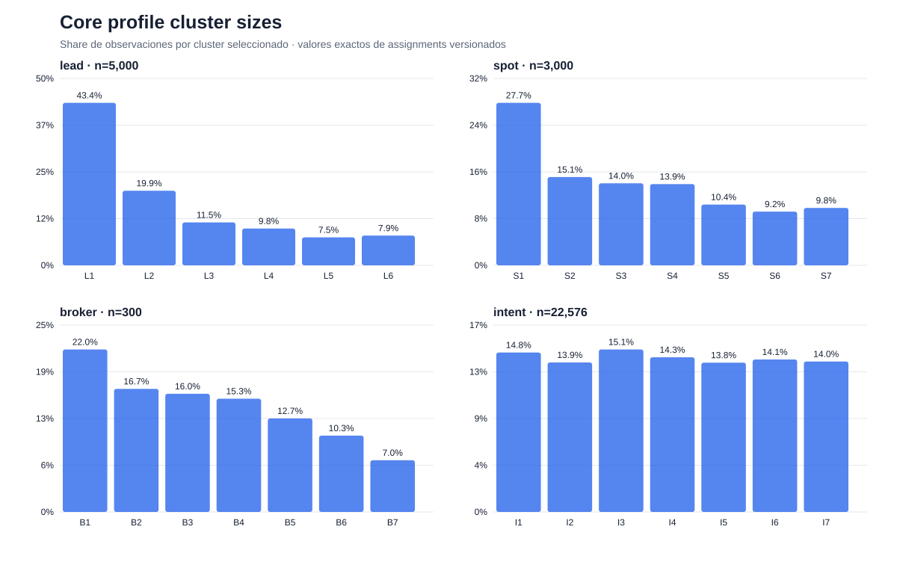

Fuente: assignments versionados de Lead, Spot, Broker e Intent.

Se muestran shares completos, no sólo el cluster dominante.

---

## 4. Tamaños de clusters usados en Matching v4

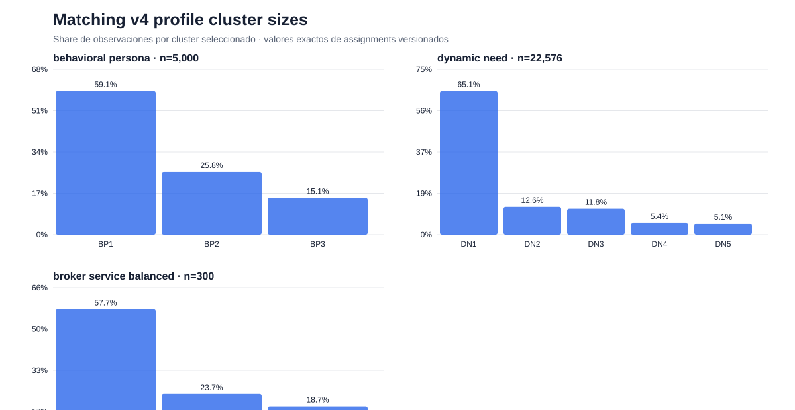

Incluye:
- Behavioral Persona;
- Dynamic Need;
- Broker Service Balanced.

La concentración de Dynamic Need en DN1 y de Broker Service en BSV1 queda visible y debe considerarse al interpretar compatibilidades.

---

## 5. Drift de prevalencia del target por fold y stage

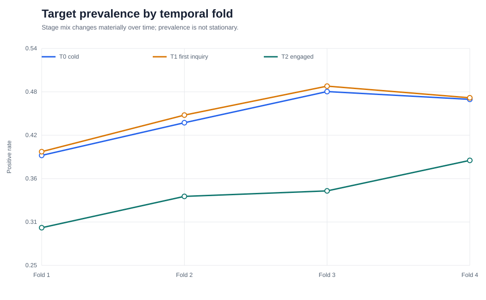

Fuente: `modelo_3/architecture_cv/results/fold_metrics.csv`.

La prevalencia cambia entre folds y stages. Por tanto, una parte de la variación de AP/Brier/Lift ocurre sobre poblaciones temporalmente distintas y no debe interpretarse como puro cambio del modelo.

---

## 6. Hybrid AP por stage y fold

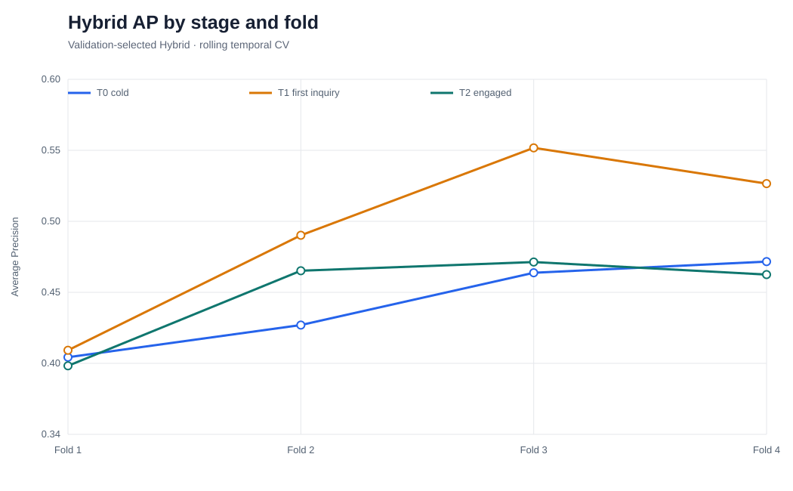

Fuente: rolling temporal CV.

Permite ver dónde el Hybrid es estable y dónde el ranking agregado oculta diferencias por stage.

---

## 7. Hybrid Lift@10 por stage y fold

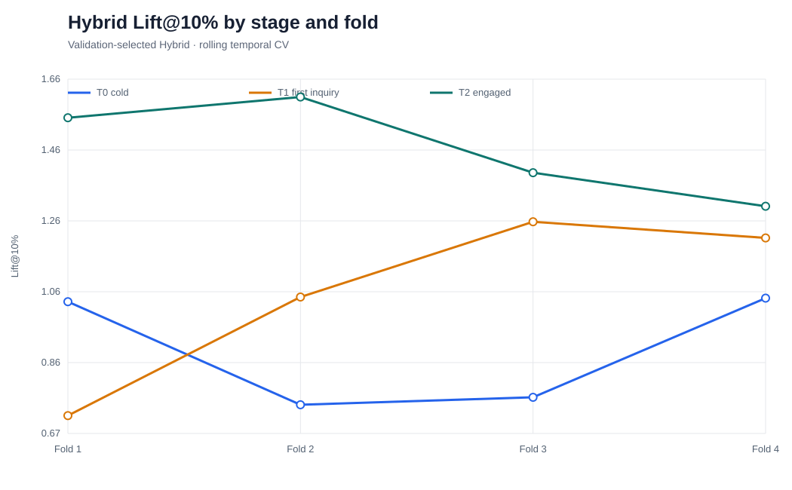

Complementa AP con el KPI operacional de priorización.

---

## 8. Composición del semantic discovery

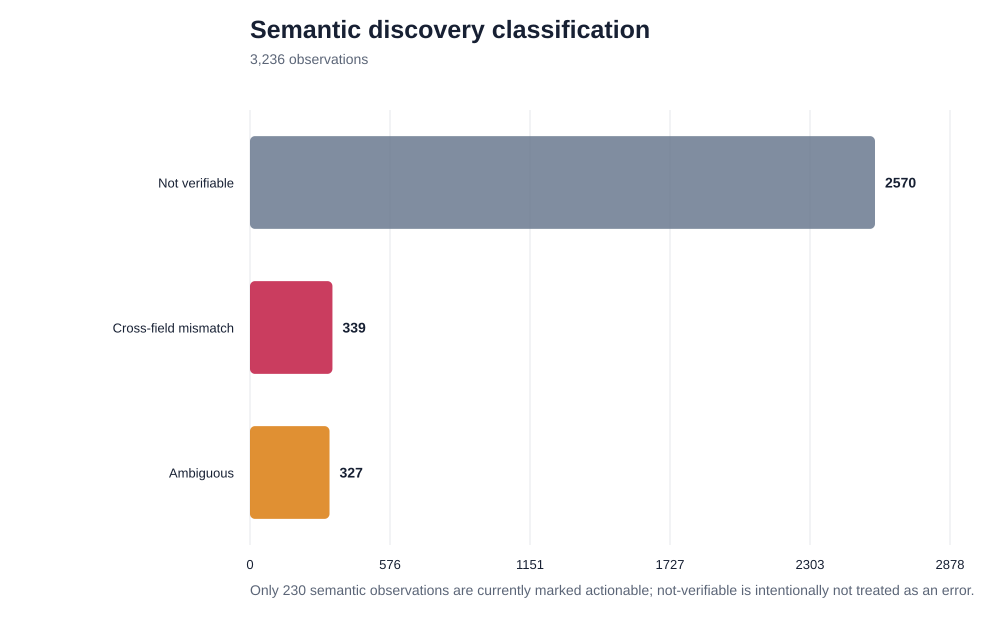

Resultados offline:
- 2,570 observaciones `not_verifiable`;
- 339 `semantic_cross_field_mismatch`;
- 327 `ambiguous`;
- 230 observaciones semánticas marcadas como accionables.

**Guardrail:** `not_verifiable` no se presenta como error de inventario.

---

## 9. Contradicciones candidatas por regla y severidad

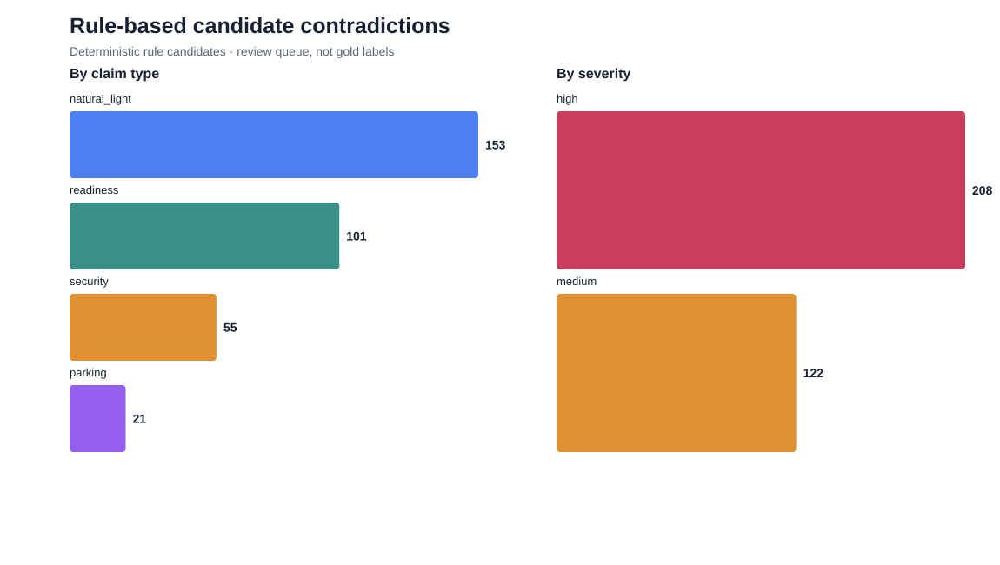

Fuente: `rule_candidate_issues.csv`.

Principales familias:
- natural light: 153;
- readiness: 101;
- security: 55;
- parking: 21.

Severidad:
- high: 208;
- medium: 122.

---

## 10. Rules v1 → v2

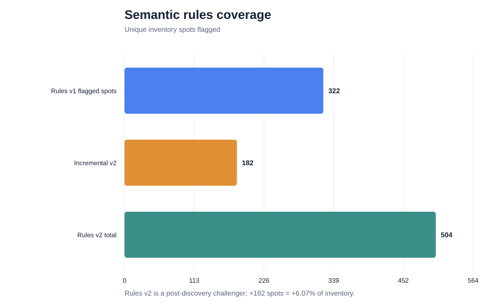

- Rules v1: 322 spots únicos.
- Rules v2: 504.
- Incremental: +182 spots, equivalentes a +6.07% del inventario.

Rules v2 es un challenger **post-discovery** y no debe evaluarse como si hubiera sido pre-registrado.

---

## 11. Ejemplos concretos de contradicción

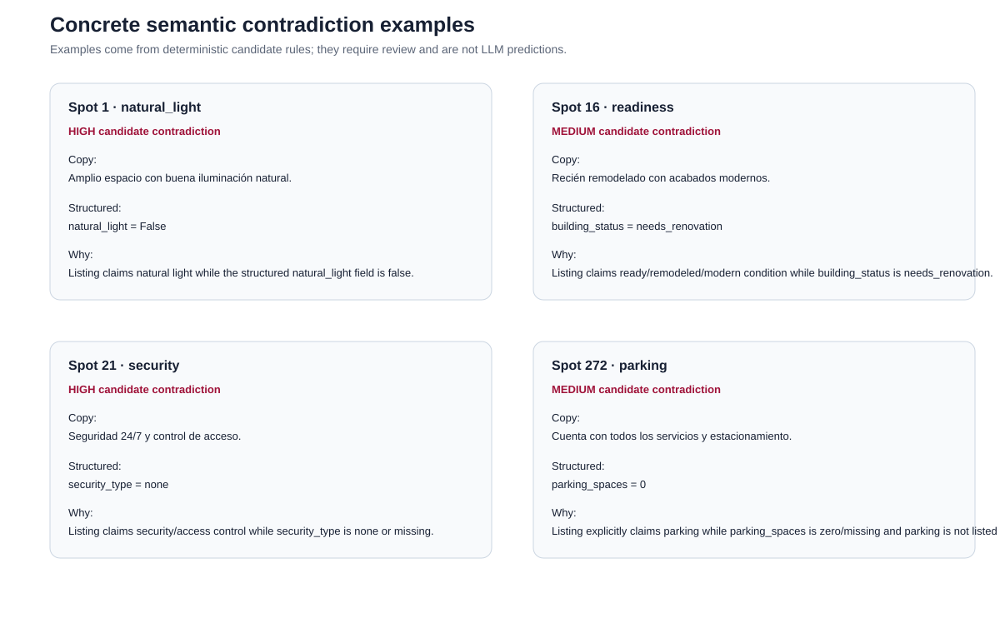

Se incluyen ejemplos reales de:
- natural light;
- readiness;
- security;
- parking.

Cada tarjeta muestra copy, campo estructurado y razón de conflicto.

**Importante:** son candidatos deterministas para review, no predicciones del LLM.

---

## 12. Executive visual summary

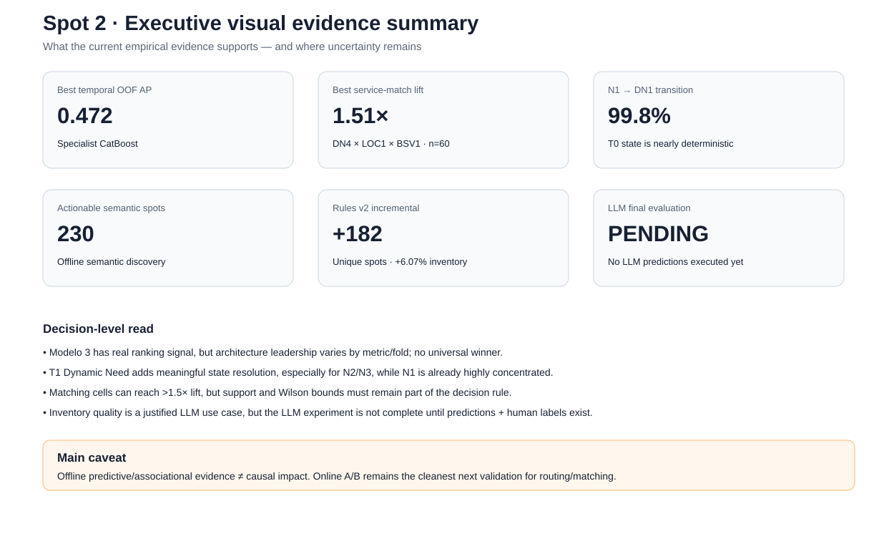

Resumen visual de los descubrimientos que actualmente tienen mayor relevancia para decisión:
- desempeño predictivo;
- matching;
- transición T0→T1;
- inventory quality;
- estado real del experimento LLM;
- caveat causal.

---

# Conclusión de Fase 4

Con esta fase la evidencia visual deja de responder solamente “qué ganó” y empieza a responder también:

1. **¿Es estable el resultado?**
2. **¿Depende de k o del algoritmo?**
3. **¿Está balanceada la representación?**
4. **¿Cambia la población objetivo en el tiempo?**
5. **¿El hallazgo semántico es realmente verificable?**
6. **¿Qué parte del caso LLM está ejecutada y cuál sigue pendiente?**

No se agregan nuevas afirmaciones causales. Los gráficos materializan resultados ya versionados.
